# MYS CONNECT — Product Requirements Document

**Version:** 1.0.0
**Date:** 2026-07-25
**Status:** Draft — Pending Stakeholder Approval
**Organization:** Maheshwari Yuva Sangathan (MYS), Ranchi
**Document Owner:** Product Management
**Classification:** Internal — Confidential

---

## Document Control

| Field | Value |
|---|---|
| Document ID | MYS-PRD-2026-001 |
| Version | 1.0.0 |
| Created | 2026-07-25 |
| Last Updated | 2026-07-25 |
| Review Cycle | Bi-weekly |
| Approved By | — Pending — |

### Revision History

| Version | Date | Author | Description |
|---|---|---|---|
| 0.1.0 | 2026-07-25 | Product Team | Initial rough notes |
| 1.0.0 | 2026-07-25 | Product Team | Complete enterprise PRD |

---

## Table of Contents

1. [Executive Summary](#1-executive-summary)
2. [Product Overview](#2-product-overview)
3. [User Personas](#3-user-personas)
4. [Complete User Flows](#4-complete-user-flows)
5. [Information Architecture](#5-information-architecture)
6. [Functional Requirements](#6-functional-requirements)
7. [Role-Based Access Matrix](#7-role-based-access-matrix)
8. [Database Design](#8-database-design)
9. [API Planning](#9-api-planning)
10. [Security](#10-security)
11. [Notifications](#11-notifications)
12. [File Management](#12-file-management)
13. [Offline Support](#13-offline-support)
14. [Performance Requirements](#14-performance-requirements)
15. [Accessibility](#15-accessibility)
16. [Non-Functional Requirements](#16-non-functional-requirements)
17. [Admin Dashboard Specification](#17-admin-dashboard-specification)
18. [UI Guidelines](#18-ui-guidelines)
19. [Error Handling](#19-error-handling)
20. [Testing Strategy](#20-testing-strategy)
21. [Future Roadmap](#21-future-roadmap)
22. [Risks](#22-risks)
23. [Open Questions](#23-open-questions)

---

## 1. Executive Summary

### 1.1 Business Problem

Maheshwari Yuva Sangathan (MYS), Ranchi is a community youth organization serving the Maheshwari community across multiple cities (Ranchi, Jaipur, Jodhpur, Kota, Udaipur, and others). Today, member management, event coordination, notice dissemination, and community engagement are handled through fragmented channels — WhatsApp groups, phone trees, printed directories, and word-of-mouth. This results in:

- **No centralized member directory** — Members cannot discover or connect with each other systematically.
- **Inefficient event communication** — Event details are shared inconsistently, RSVP tracking is manual, and post-event media is scattered.
- **Zero digital presence** — Guests and prospective members have no way to explore the organization before joining.
- **Administrative overhead** — Executives spend disproportionate time on coordination instead of community building.
- **No data-driven decisions** — Leadership lacks visibility into member engagement, event attendance, and organizational growth.

### 1.2 Vision

**"Connecting Every Member, Digitally"** — Build a unified digital platform that transforms MYS Ranchi into a digitally empowered community where every member is connected, every event is accessible, and every initiative is amplified.

### 1.3 Mission

Deliver a mobile-first community management platform that digitizes the member directory, streamlines event management, centralizes notices, and empowers administrators with data — all while preserving the cultural values of सेवा (Service), त्याग (Sacrifice), and सदाचार (Good Conduct).

### 1.4 Goals

| ID | Goal | Measure | Target |
|---|---|---|---|
| G-01 | Digitize member directory | Members onboarded | 80% of active members within 6 months |
| G-02 | Streamline event management | Events managed digitally | 100% of events within 3 months |
| G-03 | Centralize communications | Notice delivery rate | >95% read rate within 48 hours |
| G-04 | Enable guest discovery | Guest → Member conversion | 15% conversion rate |
| G-05 | Reduce admin overhead | Admin time on coordination | 50% reduction within 6 months |
| G-06 | Build engagement habit | Monthly Active Users (MAU) | 60% of total members |

### 1.5 Target Users

| Segment | Description | Estimated Size |
|---|---|---|
| Community Members | Maheshwari community members across cities (primarily Ranchi) | 1,000–5,000 |
| Organization Executives | MYS office bearers, committee heads, coordinators | 20–50 |
| Volunteers | Active event volunteers, coordinators | 50–100 |
| Guests | Prospective members, curious visitors | Unbounded |
| System Administrators | Technical admins managing the platform | 2–5 |

### 1.6 Business Value

- **Member Retention:** Digital engagement increases retention by creating visible community value.
- **Operational Efficiency:** Automated workflows replace manual coordination, saving 20+ hours/month for executives.
- **Growth:** Guest mode creates a low-friction discovery path, increasing new member acquisition.
- **Transparency:** Digital audit trails and reports build organizational trust.
- **Scalability:** Platform architecture supports expansion to other MYS chapters (other cities).

### 1.7 KPIs & Success Metrics

| KPI | Baseline | 3-Month Target | 6-Month Target |
|---|---|---|---|
| Registered Members | 0 | 500 | 1,200 |
| Monthly Active Users | 0 | 300 | 700 |
| Events Created/Month | 0 | 3 | 5 |
| Event Registration Rate | N/A | 40% | 60% |
| Notice Read Rate | N/A | 70% | 90% |
| Guest → Member Conversion | N/A | 10% | 15% |
| Admin Dashboard Logins/Week | N/A | 5 | 10 |
| Average App Session Duration | N/A | 3 min | 5 min |
| App Store Rating | N/A | 4.0+ | 4.3+ |

---

## 2. Product Overview

### 2.1 Purpose

MYS CONNECT is a cross-platform community management application that provides:
- A **mobile app** (Android & iOS) for members and guests to access the member directory, events, gallery, notices, and profiles.
- A **web admin dashboard** for organization administrators to manage members, events, content, and view analytics.

### 2.2 Scope

#### In Scope (MVP — Phase 1)

| Module | Description |
|---|---|
| Authentication | Login, registration, guest mode, forgot password, logout |
| Member Directory | Searchable, filterable list of community members with profiles |
| Events Management | Event listing, details, registration, status management |
| Gallery | Photo albums organized by category (Events, Celebrations, Others) |
| Notices | Categorized notices (General, Important, Circulars) |
| Profile Management | Personal info, address, business/occupation, family details, photo |
| Notifications | Push notifications for events, notices, approvals |
| Admin Dashboard | Member management, event CRUD, notice CRUD, gallery management, analytics, reports |
| Guest Mode | Limited access to members directory and events without login |

#### 2.3 Out of Scope

| Feature | Rationale |
|---|---|
| Payment/Donation processing | Requires payment gateway integration; deferred to Phase 2 |
| Chat/Messaging between members | Complex real-time feature; deferred to Phase 2 |
| Multi-language support (i18n) | Single language (English with Hindi labels) for MVP |
| Multi-chapter management | MVP targets Ranchi chapter only; multi-tenancy deferred |
| SMS-based OTP login | Clerk.com handles auth; SMS OTP depends on Clerk plan |
| Video content in gallery | Image-only gallery for MVP; video deferred |
| Automated email campaigns | Manual notices for MVP; campaign automation deferred |
| AI-powered features | Deferred to Phase 3 |

### 2.4 Assumptions

| ID | Assumption |
|---|---|
| A-01 | Organization will assign at least 1 Super Admin and 2 Admins at launch |
| A-02 | Member registration requires admin approval (not open/self-service) |
| A-03 | Member data (names, contacts) will be seeded by admin via bulk import or manual entry |
| A-04 | Clerk.com free/starter plan supports the expected user volume |
| A-05 | Members will primarily use Android devices (80%+ market share in Ranchi) |
| A-06 | Internet connectivity is available for core operations; offline mode is read-only cache |
| A-07 | City filter on member directory refers to city of residence, not MYS chapter affiliation |
| A-08 | Gallery images are uploaded by admins only, not by members |
| A-09 | Events are created by admins; members can only register/view |
| A-10 | Family details in profile are optional and self-reported |

### 2.5 Constraints

| ID | Constraint |
|---|---|
| C-01 | Budget is limited — no paid third-party SaaS beyond Clerk.com and Cloudinary free tiers |
| C-02 | Hosting is local PostgreSQL on Docker initially; cloud migration planned later |
| C-03 | Team size is small — 1–2 developers, making incremental delivery essential |
| C-04 | Expo managed workflow limits native module usage |
| C-05 | Cloudinary free tier has storage and transformation limits (25GB storage, 25GB bandwidth/month) |

### 2.6 Dependencies

| ID | Dependency | Impact if Unavailable |
|---|---|---|
| D-01 | Clerk.com | Authentication completely blocked |
| D-02 | Cloudinary | Image upload/display blocked; fallback to local storage needed |
| D-03 | Expo Push Notification service | Push notifications unavailable |
| D-04 | Docker + PostgreSQL | Entire backend blocked |
| D-05 | Socket.io server | Real-time features (notifications, live updates) unavailable |
| D-06 | Member data from organization | Empty directory at launch |

---

## 3. User Personas

### 3.1 Guest

| Attribute | Detail |
|---|---|
| **Who** | Prospective member, curious visitor, or community member not yet registered |
| **Goals** | Explore MYS community, view member directory, browse upcoming events, decide whether to join |
| **Pain Points** | No visibility into what MYS does; has to ask someone personally; can't see member list without knowing someone |
| **Permissions** | View-only access to Member Directory (limited fields), Events list, About page |
| **Devices** | Primarily Android smartphones |
| **Journey** | Opens app → Splash → Login screen → Taps "Continue as Guest" → Guest Home → Explores Members / Events → Decides to register → Taps LOGIN / Register Now |

### 3.2 Member

| Attribute | Detail |
|---|---|
| **Who** | Registered and approved community member of MYS Ranchi |
| **Goals** | Stay connected with community, view other members, register for events, receive notices, manage profile |
| **Pain Points** | Misses event announcements on WhatsApp, can't find contact details of other members, no centralized place for community updates |
| **Permissions** | Full access to Member Directory, Events (view + register), Gallery, Notices, Notifications, own Profile management |
| **Devices** | Android (primary), iOS (secondary) |
| **Journey** | Login → Member Home → Browse Quick Access (Members/Events/Gallery/Notices) → View upcoming events → Register for event → Check notifications → Update profile |

### 3.3 Volunteer

| Attribute | Detail |
|---|---|
| **Who** | Active member who assists in event coordination and community activities |
| **Goals** | Help manage events on the ground, track registrations, coordinate logistics |
| **Pain Points** | No structured way to know assigned responsibilities, lacks visibility into registration numbers |
| **Permissions** | All Member permissions + View event registrations + limited event updates (e.g., mark attendance) |
| **Devices** | Android smartphones |
| **Journey** | Login → Events → View assigned event → Check registrations → Mark attendance → Report to admin |

### 3.4 Executive

| Attribute | Detail |
|---|---|
| **Who** | MYS office bearers — President, Secretary, Treasurer, Committee Heads |
| **Goals** | Oversee organization operations, publish events and notices, review member growth, make data-driven decisions |
| **Pain Points** | No dashboard, spends time calling people for updates, no visibility into engagement metrics |
| **Permissions** | All Member permissions + Create/Edit Events + Create/Edit Notices + Upload Gallery + View Reports + Approve/Reject member registrations |
| **Devices** | Android phone + Desktop/Laptop (for admin dashboard) |
| **Journey** | Mobile: Member experience + content creation. Web: Admin Dashboard → Review KPIs → Manage content → Generate reports |

### 3.5 Admin

| Attribute | Detail |
|---|---|
| **Who** | Designated administrator managing the platform day-to-day |
| **Goals** | Manage all users, content, events, and settings; ensure platform runs smoothly |
| **Pain Points** | No tools to manage members digitally; everything is spreadsheets and notebooks |
| **Permissions** | Full system access except system configuration and role management of other admins |
| **Devices** | Desktop/Laptop (primary), Mobile (secondary) |
| **Journey** | Web Dashboard → Review pending registrations → Approve/Reject → Create events → Publish notices → Upload gallery → Monitor activity |

### 3.6 Super Admin

| Attribute | Detail |
|---|---|
| **Who** | System owner / technical administrator with highest privileges |
| **Goals** | Configure system, manage roles and permissions, oversee all admins, handle escalations |
| **Pain Points** | Needs complete control and audit visibility |
| **Permissions** | All Admin permissions + Role management + Permission configuration + System settings + Audit logs + Bulk import/export |
| **Devices** | Desktop/Laptop |
| **Journey** | Web Dashboard → System settings → Manage admin roles → Review audit logs → Bulk operations → Monitor system health |

---

## 4. Complete User Flows

### 4.1 Guest Journey

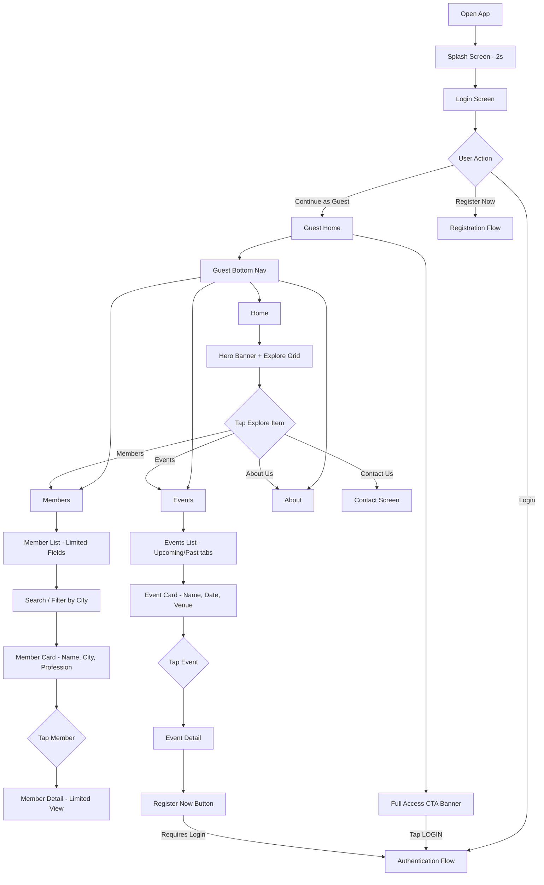

### 4.2 Member Journey

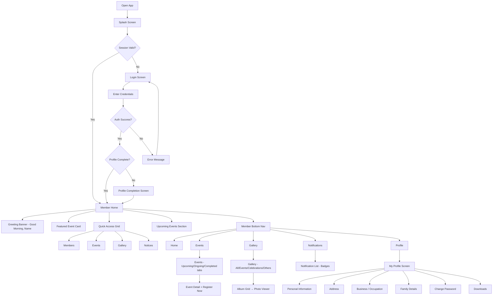

### 4.3 Registration Flow

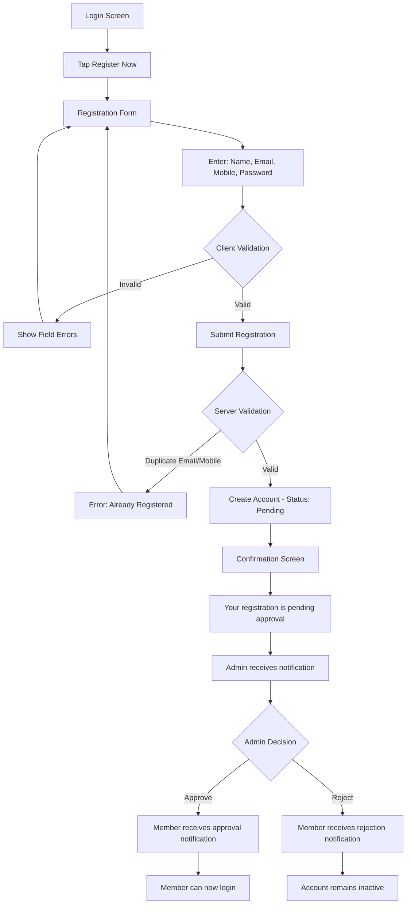

### 4.4 Login Flow

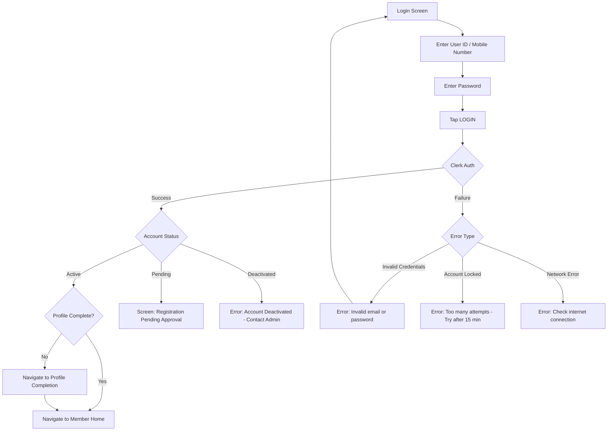

### 4.5 Forgot Password Flow

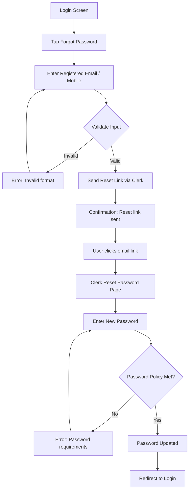

### 4.6 Admin Journey

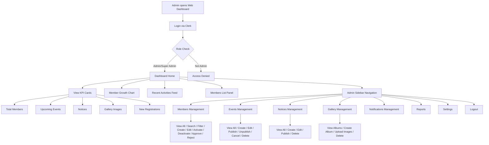

### 4.7 Notification Flow

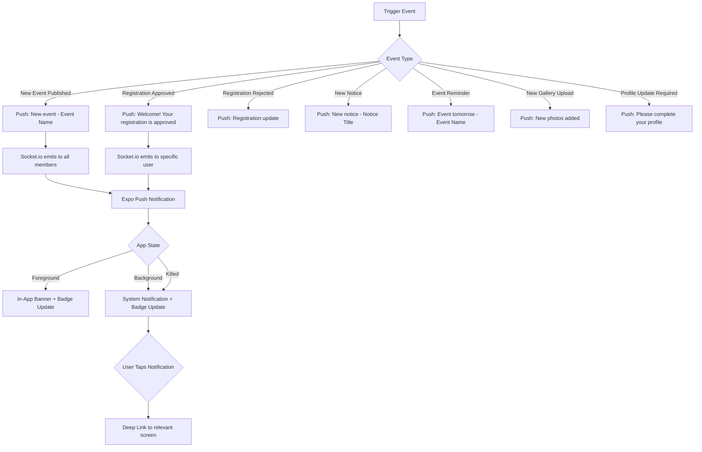

### 4.8 Logout Flow

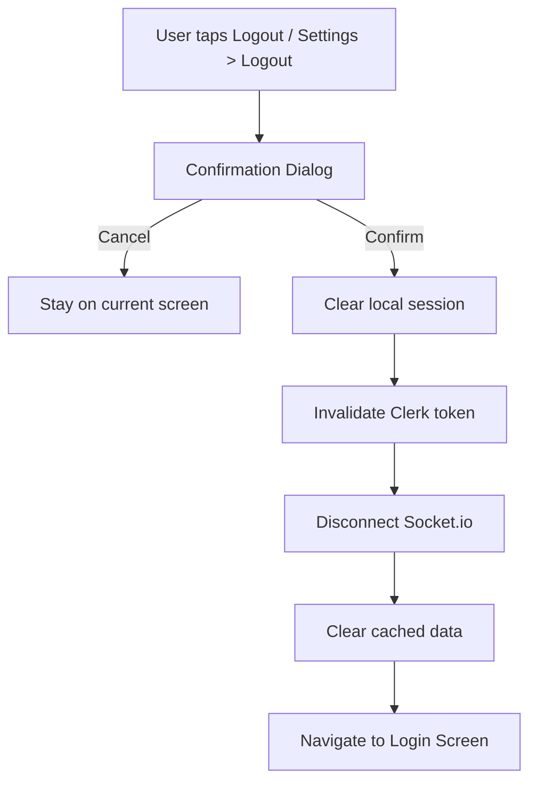

---

## 5. Information Architecture

### 5.1 Navigation Hierarchy — Mobile App

#### Guest Bottom Navigation

| Position | Label | Icon | Screen |
|---|---|---|---|
| 1 | Home | 🏠 | Guest Home |
| 2 | Members | 👥 | Member Directory (limited) |
| 3 | Events | 📅 | Events List |
| 4 | About | ℹ️ | About Us |

#### Member Bottom Navigation

| Position | Label | Icon | Screen |
|---|---|---|---|
| 1 | Home | 🏠 | Member Home |
| 2 | Events | 📅 | Events List |
| 3 | Gallery | 🖼️ | Gallery |
| 4 | Notifications | 🔔 (badge) | Notification List |
| 5 | Profile | 👤 | My Profile |

#### Member Home — Quick Access Grid

| Position | Label | Icon | Navigates To |
|---|---|---|---|
| 1 | Members | 👥 | Member Directory |
| 2 | Events | 📅 | Events List |
| 3 | Gallery | 🖼️ | Gallery |
| 4 | Notices | 📋 | Notices List |

### 5.2 Screen Hierarchy

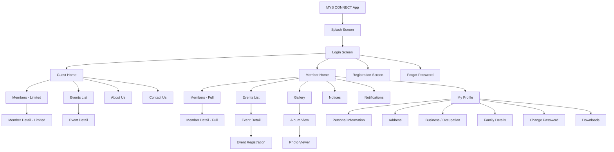

### 5.3 Admin Sidebar Navigation

| Position | Label | Icon | Screen |
|---|---|---|---|
| — | MYS CONNECT Logo + "Admin Panel" | Logo | — |
| 1 | Dashboard | 📊 | Dashboard Home |
| 2 | Members | 👥 | Members Management |
| 3 | Events | 📅 | Events Management |
| 4 | Notices | 📋 | Notices Management |
| 5 | Gallery | 🖼️ | Gallery Management |
| 6 | Notifications | 🔔 | Notification Management |
| 7 | Reports | 📈 | Reports & Analytics |
| 8 | Settings | ⚙️ | System Settings |
| — | Logout | 🚪 | Logout |

---

## 6. Functional Requirements

### 6.1 Splash Screen

| Field | Detail |
|---|---|
| **Req ID** | FR-SPLASH-001 |
| **Purpose** | Brand introduction, session validation, and routing |
| **Description** | Displays MYS logo, organization name "MYS CONNECT", tagline "Connecting Every Member, Digitally", and three feature highlights (Guest Mode, Member Access, Admin Panel) while checking auth state |

**User Story:** As a user, I want to see the app brand while it loads so that I know I'm in the right application.

**Actors:** All users (Guest, Member, Admin)

**Preconditions:** App is installed and launched.

**Business Rules:**
- BR-SPLASH-01: Display splash for minimum 2 seconds, maximum 4 seconds.
- BR-SPLASH-02: Check Clerk session token validity during splash.
- BR-SPLASH-03: If valid token exists and account is active, navigate directly to Member Home.
- BR-SPLASH-04: If no valid token, navigate to Login Screen.

**Acceptance Criteria:**
- AC-01: Splash displays MYS logo, app name, tagline within 500ms of launch.
- AC-02: Three feature cards (Guest Mode, Member Access, Admin Panel) are visible.
- AC-03: Auto-navigates to appropriate screen after 2 seconds.
- AC-04: If session is valid, user skips login.
- AC-05: If session is expired/invalid, user sees login screen.

**Edge Cases:**
- Network unavailable during token check → Navigate to Login with cached session state.
- Token expired → Clear local data, show Login.

---

### 6.2 Login Screen

| Field | Detail |
|---|---|
| **Req ID** | FR-LOGIN-001 |
| **Purpose** | Authenticate members and admins into the system |
| **Description** | Form with User ID / Mobile Number field, Password field (with visibility toggle), Login button, Forgot Password link, "Continue as Guest" button, and "Register Now" link |

**User Story:** As a member, I want to log in with my credentials so that I can access my community features.

**Actors:** Member, Admin, Super Admin

**Preconditions:** User has a registered account.

**Business Rules:**
- BR-LOGIN-01: User ID can be email address or registered mobile number.
- BR-LOGIN-02: Password field must have show/hide toggle.
- BR-LOGIN-03: Maximum 5 failed login attempts before 15-minute lockout.
- BR-LOGIN-04: "Continue as Guest" button navigates to Guest Home without authentication.
- BR-LOGIN-05: "Register Now" link navigates to Registration Screen.
- BR-LOGIN-06: "Forgot Password?" link initiates password reset flow via Clerk.

**Validation:**
| Field | Rule |
|---|---|
| User ID / Mobile | Required. Valid email format OR 10-digit Indian mobile number |
| Password | Required. Minimum 1 character (Clerk handles policy) |

**Success Flow:**
1. User enters credentials.
2. Client validates format.
3. System calls Clerk authentication API.
4. Clerk returns session token.
5. System checks user status in local DB (Active/Pending/Deactivated).
6. If Active → Check profile completeness → Navigate accordingly.

**Failure Flow:**
| Scenario | Response |
|---|---|
| Empty fields | Inline validation: "This field is required" |
| Invalid email format | Inline: "Enter a valid email address" |
| Wrong credentials | Toast: "Invalid email or password" |
| Account pending | Screen: "Your registration is pending admin approval" |
| Account deactivated | Dialog: "Your account has been deactivated. Contact admin." |
| Rate limited | Dialog: "Too many attempts. Try again after 15 minutes." |
| Network error | Toast: "No internet connection. Please try again." |

**Acceptance Criteria:**
- AC-01: User can log in with email + password.
- AC-02: User can log in with mobile number + password.
- AC-03: Password visibility toggle works.
- AC-04: Failed login shows appropriate error.
- AC-05: 5 consecutive failures trigger lockout.
- AC-06: "Continue as Guest" navigates to Guest Home.
- AC-07: "Register Now" navigates to Registration.
- AC-08: "Forgot Password?" initiates Clerk password reset.

---

### 6.3 Registration Screen

| Field | Detail |
|---|---|
| **Req ID** | FR-REG-001 |
| **Purpose** | Allow new users to request membership in the platform |
| **Description** | Registration form collecting basic information; submission creates a pending account requiring admin approval |

**User Story:** As a prospective member, I want to register for an account so that I can access the community features after approval.

**Actors:** Unregistered User

**Preconditions:** User does not have an existing account.

**Business Rules:**
- BR-REG-01: Registration creates account with status `PENDING_APPROVAL`.
- BR-REG-02: Admin must approve before user can log in.
- BR-REG-03: Duplicate email or mobile number is rejected.
- BR-REG-04: Password must meet Clerk's password policy (minimum 8 characters).
- BR-REG-05: Email verification is triggered via Clerk.
- BR-REG-06: Upon registration, admin receives push notification.

**Validation:**

| Field | Rule |
|---|---|
| Full Name | Required. 2–100 characters. Alphabets and spaces only. |
| Email | Required. Valid email format. Unique. |
| Mobile Number | Required. 10-digit Indian mobile. Unique. |
| Password | Required. Min 8 chars, 1 uppercase, 1 number. |
| Confirm Password | Required. Must match Password. |

**Acceptance Criteria:**
- AC-01: Form displays all required fields.
- AC-02: Client-side validation runs on blur and submit.
- AC-03: Duplicate email/mobile shows specific error.
- AC-04: Successful submission shows confirmation screen.
- AC-05: User cannot log in until admin approves.
- AC-06: Admin receives notification of new registration.

---

### 6.4 Guest Home

| Field | Detail |
|---|---|
| **Req ID** | FR-GHOME-001 |
| **Purpose** | Landing page for unauthenticated guests to explore the community |
| **Description** | Displays greeting "Welcome, Guest", hero banner with MYS branding ("Building Bonds, Strengthening Community" + Learn More CTA), Explore grid (Members, Events, About Us, Contact Us), full-access CTA banner at bottom prompting login |

**User Story:** As a guest, I want to explore the community so that I can decide whether to become a member.

**Actors:** Guest

**Preconditions:** User tapped "Continue as Guest" on Login Screen.

**Business Rules:**
- BR-GHOME-01: Header shows hamburger menu (drawer) and notification bell (disabled for guests).
- BR-GHOME-02: Hero banner is configurable by admin (image + text).
- BR-GHOME-03: Explore grid shows 4 items: Members, Events, About Us, Contact Us.
- BR-GHOME-04: Bottom section shows "Want full access?" banner with LOGIN button.
- BR-GHOME-05: Bottom navigation shows: Home, Members, Events, About.

**Acceptance Criteria:**
- AC-01: Guest Home renders within 1 second.
- AC-02: Hero banner displays community image and tagline.
- AC-03: All 4 explore items are tappable and navigate correctly.
- AC-04: LOGIN CTA navigates to Login Screen.
- AC-05: Guest bottom navigation has 4 tabs.
- AC-06: No access to Gallery, Notices, Notifications, or Profile from guest mode.

---

### 6.5 Member Home

| Field | Detail |
|---|---|
| **Req ID** | FR-MHOME-001 |
| **Purpose** | Personalized landing page for authenticated members |
| **Description** | Shows greeting with user name and avatar ("Good Morning, Rajesh Kumar 👋"), featured event card with Register Now CTA, Quick Access grid (Members, Events, Gallery, Notices) with "View All" links, and Upcoming Events list |

**User Story:** As a member, I want to see relevant community information at a glance when I open the app.

**Actors:** Member, Volunteer, Executive

**Preconditions:** User is authenticated and account is Active.

**Business Rules:**
- BR-MHOME-01: Greeting is dynamic based on time of day (Good Morning / Good Afternoon / Good Evening).
- BR-MHOME-02: User's profile photo and full name displayed in header.
- BR-MHOME-03: Settings gear icon in header navigates to Settings screen.
- BR-MHOME-04: Featured event is the nearest upcoming event with registration open.
- BR-MHOME-05: Quick Access shows counts (if applicable) and "View All" links.
- BR-MHOME-06: Upcoming Events section shows next 3 events.
- BR-MHOME-07: Bottom navigation: Home, Events, Gallery, Notifications (with badge), Profile.

**Acceptance Criteria:**
- AC-01: Greeting shows correct time-based salutation.
- AC-02: User name and photo are displayed.
- AC-03: Featured event card is tappable → Event Detail.
- AC-04: "Register Now" on featured event initiates registration.
- AC-05: Quick Access grid items navigate to respective screens.
- AC-06: Upcoming events list is scrollable.
- AC-07: Notification badge shows unread count.

---

### 6.6 Member Directory

| Field | Detail |
|---|---|
| **Req ID** | FR-MEMDIR-001 |
| **Purpose** | Searchable, filterable list of community members |
| **Description** | List view with search bar, city filter chips (All, Jaipur, Jodhpur, Kota, Udaipur, etc.), member cards showing profile photo, name, city, state, and profession/occupation. Tap opens member detail. |

**User Story:** As a member, I want to search and find other community members so that I can connect with them.

**Actors:** Guest (limited), Member, Executive, Admin

**Preconditions:** Members exist in the system.

**Business Rules:**
- BR-MEMDIR-01: Guest sees limited fields: Name, City, Profession. No contact details.
- BR-MEMDIR-02: Member sees: Name, City, State, Profession, Profile Photo. Tap for full detail.
- BR-MEMDIR-03: Search matches against name (partial, case-insensitive).
- BR-MEMDIR-04: City filter shows dynamically populated filter chips based on available cities.
- BR-MEMDIR-05: Default filter is "All".
- BR-MEMDIR-06: List is paginated (20 members per page, infinite scroll).
- BR-MEMDIR-07: Members sorted alphabetically by default.
- BR-MEMDIR-08: Only Active members are displayed. Pending/Deactivated are excluded.
- BR-MEMDIR-09: Member's own profile appears in list but tapping navigates to own profile screen.

**Validation:**
| Field | Rule |
|---|---|
| Search query | Minimum 2 characters to trigger search |

**Acceptance Criteria:**
- AC-01: Member list loads within 2 seconds.
- AC-02: Search returns results as user types (debounced 300ms).
- AC-03: City filter chips are horizontally scrollable.
- AC-04: Selecting a city filter immediately filters the list.
- AC-05: Empty state: "No members found" with illustration.
- AC-06: Infinite scroll loads next page seamlessly.
- AC-07: Guest view omits contact details.
- AC-08: Pull-to-refresh updates the list.

---

### 6.7 Member Detail

| Field | Detail |
|---|---|
| **Req ID** | FR-MEMDET-001 |
| **Purpose** | Display detailed profile information of a community member |
| **Description** | Full profile view showing photo, name, member ID, membership status badge, and sections for personal info, address, business/occupation, and family details |

**User Story:** As a member, I want to view another member's full profile so that I can connect with them.

**Actors:** Guest (limited), Member, Admin

**Business Rules:**
- BR-MEMDET-01: Guest view shows: Name, City, Profession only.
- BR-MEMDET-02: Member view shows: Name, Photo, Member ID, Status, Contact, Email, Address, Business, City, State.
- BR-MEMDET-03: Admin view shows all fields including family details and account status.
- BR-MEMDET-04: Contact number has "Call" and "WhatsApp" action buttons (member view only).
- BR-MEMDET-05: Email has "Send Email" action button.
- BR-MEMDET-06: Data visibility respects the member's privacy settings (future enhancement).

**Acceptance Criteria:**
- AC-01: Profile photo is displayed prominently.
- AC-02: Member ID and status badge are visible.
- AC-03: Call/WhatsApp buttons open respective apps.
- AC-04: Guest view is distinctly limited (no contact info).
- AC-05: Back navigation returns to Member Directory.

---

### 6.8 Events List

| Field | Detail |
|---|---|
| **Req ID** | FR-EVTLIST-001 |
| **Purpose** | Display all community events with filtering by status |
| **Description** | Tabbed list view with Upcoming, Ongoing, Completed (member view) or Upcoming, Past (guest view). Each event card shows date badge (day + month), event name, date/time, venue. Upcoming events show "Register Now" button. |

**User Story:** As a member, I want to browse community events so that I can register and participate.

**Actors:** Guest, Member, Admin

**Business Rules:**
- BR-EVTLIST-01: Guest view shows two tabs: Upcoming, Past.
- BR-EVTLIST-02: Member view shows three tabs: Upcoming, Ongoing, Completed.
- BR-EVTLIST-03: Each event card displays: Date badge (day + abbreviated month in color), Event name, Full date + time, Venue with address.
- BR-EVTLIST-04: Upcoming events with open registration show "Register Now" button.
- BR-EVTLIST-05: Events sorted by date (nearest first for Upcoming, most recent first for Past/Completed).
- BR-EVTLIST-06: Search icon in header allows event search.
- BR-EVTLIST-07: Cancelled events are excluded from guest view; shown with "Cancelled" badge in member view.
- BR-EVTLIST-08: List is paginated (10 events per page, infinite scroll).

**Acceptance Criteria:**
- AC-01: Tab switching filters events by status.
- AC-02: Event cards display all required information.
- AC-03: Date badge uses color-coded month labels (matching wireframe).
- AC-04: "Register Now" is only shown for upcoming events with open registration.
- AC-05: Tapping event card navigates to Event Detail.
- AC-06: Empty tab shows: "No events found" with illustration.

---

### 6.9 Event Detail

| Field | Detail |
|---|---|
| **Req ID** | FR-EVTDET-001 |
| **Purpose** | Display comprehensive information about a specific event |
| **Description** | Detail screen showing event banner image, event name, date, time, venue, address/location, description, organizer details, registration deadline, status, and registration action |

**User Story:** As a member, I want to see full event details so that I can decide whether to register.

**Actors:** Guest (view only), Member (view + register)

**Business Rules:**
- BR-EVTDET-01: Display fields: Banner Image, Name, Date, Time, Venue, Address, Description, Organizer, Registration Deadline, Status.
- BR-EVTDET-02: If registration is open and user is authenticated, show "Register Now" CTA.
- BR-EVTDET-03: If already registered, show "Registered ✓" badge.
- BR-EVTDET-04: If registration deadline passed, show "Registration Closed".
- BR-EVTDET-05: Guest users see "Login to Register" button.
- BR-EVTDET-06: Share button allows sharing event via native share sheet.
- BR-EVTDET-07: Location address is tappable → opens in Google Maps.

**Acceptance Criteria:**
- AC-01: All event fields render correctly.
- AC-02: Banner image loads with placeholder on failure.
- AC-03: Registration state (open/closed/registered) is displayed correctly.
- AC-04: Share functionality works on both Android and iOS.
- AC-05: Location opens in maps app.

---

### 6.10 Event Registration

| Field | Detail |
|---|---|
| **Req ID** | FR-EVTREG-001 |
| **Purpose** | Allow authenticated members to register for an event |
| **Description** | Confirmation dialog or form for event registration |

**User Story:** As a member, I want to register for an event so that the organizers know I'm attending.

**Actors:** Member

**Preconditions:** User is authenticated, event is upcoming, registration is open.

**Business Rules:**
- BR-EVTREG-01: Single-tap registration with confirmation dialog.
- BR-EVTREG-02: System records: user ID, event ID, registration timestamp.
- BR-EVTREG-03: User receives push notification confirming registration.
- BR-EVTREG-04: Admin can view registration list for each event.
- BR-EVTREG-05: User can cancel registration before event date.
- BR-EVTREG-06: Duplicate registration is prevented.

**Acceptance Criteria:**
- AC-01: "Register Now" shows confirmation dialog.
- AC-02: After confirming, button changes to "Registered ✓".
- AC-03: Push notification is received.
- AC-04: Re-registering is prevented with appropriate message.
- AC-05: Registration appears in event's registration list (admin view).

---

### 6.11 Gallery

| Field | Detail |
|---|---|
| **Req ID** | FR-GALLERY-001 |
| **Purpose** | Photo gallery organized by category and albums |
| **Description** | Grid layout with category tabs (All, Events, Celebrations, Others), album cards showing cover image and title, and full-screen photo viewer with swipe navigation |

**User Story:** As a member, I want to browse community photos so that I can relive past events and celebrations.

**Actors:** Member, Executive, Admin

**Preconditions:** User is authenticated. Gallery albums exist.

**Business Rules:**
- BR-GAL-01: Category tabs: All, Events, Celebrations, Others.
- BR-GAL-02: Albums displayed as cards with cover image, album title, photo count.
- BR-GAL-03: Tapping album opens grid of photos in that album.
- BR-GAL-04: Tapping photo opens full-screen viewer with swipe.
- BR-GAL-05: Photos can be saved to device (long-press or download icon).
- BR-GAL-06: Gallery is read-only for members; upload is admin-only.
- BR-GAL-07: Search icon in header searches album names.
- BR-GAL-08: Albums sorted by most recent first.

**Acceptance Criteria:**
- AC-01: Category tabs filter albums.
- AC-02: Album grid loads with cover images.
- AC-03: Photo viewer supports swipe navigation.
- AC-04: Download/save functionality works.
- AC-05: Empty category shows "No photos yet".
- AC-06: Images are lazy-loaded with placeholders.

---

### 6.12 Notices

| Field | Detail |
|---|---|
| **Req ID** | FR-NOTICE-001 |
| **Purpose** | Display categorized organizational notices and announcements |
| **Description** | List view with category tabs (All, General, Important, Circulars), each notice card showing title, excerpt, and date |

**User Story:** As a member, I want to read community notices so that I stay informed about organizational updates.

**Actors:** Member, Executive, Admin

**Preconditions:** User is authenticated.

**Business Rules:**
- BR-NOTICE-01: Category tabs: All, General, Important, Circulars.
- BR-NOTICE-02: Notice card shows: Title, Description excerpt (2 lines), Date.
- BR-NOTICE-03: Tapping notice opens full notice detail.
- BR-NOTICE-04: Important notices show priority indicator (icon or color).
- BR-NOTICE-05: Notices sorted by date (newest first).
- BR-NOTICE-06: Unread notices have visual distinction (bold text or dot indicator).
- BR-NOTICE-07: Back arrow in header navigates back.
- BR-NOTICE-08: Notices are read-only for members.

**Acceptance Criteria:**
- AC-01: Category tabs filter notices.
- AC-02: Notice cards display all required fields.
- AC-03: Tapping opens full notice.
- AC-04: Unread indicator is visible.
- AC-05: Empty category: "No notices available".
- AC-06: Pull-to-refresh updates list.

---

### 6.13 Notifications

| Field | Detail |
|---|---|
| **Req ID** | FR-NOTIF-001 |
| **Purpose** | Centralized notification inbox for push notification history |
| **Description** | Chronological list of all notifications received by the user with unread badge on bottom nav |

**User Story:** As a member, I want to view all my notifications so that I don't miss any updates.

**Actors:** Member

**Preconditions:** User is authenticated.

**Business Rules:**
- BR-NOTIF-01: Show all notifications in reverse chronological order.
- BR-NOTIF-02: Each notification shows: icon, title, message excerpt, timestamp.
- BR-NOTIF-03: Unread notifications have visual distinction.
- BR-NOTIF-04: Tapping notification marks it as read and deep-links to relevant screen.
- BR-NOTIF-05: "Mark all as read" option in header.
- BR-NOTIF-06: Badge count on bottom nav shows unread count (0 = no badge).
- BR-NOTIF-07: Notifications older than 90 days are auto-archived.

**Acceptance Criteria:**
- AC-01: Notification list loads within 1 second.
- AC-02: Unread badge count matches actual unread count.
- AC-03: Tapping navigates to correct screen.
- AC-04: "Mark all as read" clears badge.
- AC-05: Empty state: "No notifications yet".

---

### 6.14 My Profile

| Field | Detail |
|---|---|
| **Req ID** | FR-PROFILE-001 |
| **Purpose** | View and manage personal profile information |
| **Description** | Profile screen showing user avatar, name, member ID, status badge ("Active Member"), and navigation sections: Personal Information, Address, Business / Occupation, Family Details, Change Password, Downloads |

**User Story:** As a member, I want to manage my profile so that my community information stays up to date.

**Actors:** Member

**Preconditions:** User is authenticated.

**Business Rules:**
- BR-PROF-01: Profile photo is tappable to update (camera or gallery).
- BR-PROF-02: Member ID is system-generated and read-only (format: MYS/01234).
- BR-PROF-03: Status badge shows: Active Member (green), Pending (yellow), Deactivated (red).
- BR-PROF-04: Each section navigates to an editable form.
- BR-PROF-05: Changes are saved on form submission, not auto-saved.
- BR-PROF-06: Profile update timestamp is recorded.

**Profile Sections and Fields:**

| Section | Fields | Editable |
|---|---|---|
| **Personal Information** | Full Name, Date of Birth, Email, Mobile Number, Gender | Name: Yes. DOB: Yes. Email: Requires verification. Mobile: Requires verification. |
| **Address** | Street Address, City, State, Pin Code, Country | All editable |
| **Business / Occupation** | Occupation Type, Company Name, Designation, Business Category, Business Address | All editable |
| **Family Details** | Spouse Name, Father's Name, Number of Children, Family Members list | All editable |
| **Change Password** | Current Password, New Password, Confirm Password | Via Clerk |
| **Downloads** | List of downloadable documents/resources | Read-only |

**Validation:**

| Field | Rule |
|---|---|
| Full Name | Required. 2–100 chars. |
| Date of Birth | Required. Date picker. Must be in past. Age ≥ 18. |
| Email | Required. Valid email. Unique. |
| Mobile | Required. 10-digit. Unique. |
| Pin Code | 6-digit Indian pin code. |
| Profile Photo | JPEG/PNG, max 5MB, min 200×200px. |

**Acceptance Criteria:**
- AC-01: Profile displays current user data.
- AC-02: Profile photo can be changed from camera or gallery.
- AC-03: Each section opens editable form with pre-filled data.
- AC-04: Validation errors shown inline.
- AC-05: Successful update shows success toast.
- AC-06: Member ID and status badge are displayed correctly.
- AC-07: Downloads section lists available documents.

---

### 6.15 Settings

| Field | Detail |
|---|---|
| **Req ID** | FR-SETTINGS-001 |
| **Purpose** | Application and account settings |
| **Description** | Settings menu accessible from Member Home header gear icon |

**Business Rules:**
- BR-SET-01: Notification preferences (enable/disable push).
- BR-SET-02: Language preference (future — English default for MVP).
- BR-SET-03: About App (version, build number).
- BR-SET-04: Privacy Policy link.
- BR-SET-05: Terms of Service link.
- BR-SET-06: Contact Support.
- BR-SET-07: Logout button.
- BR-SET-08: Delete Account request (sends request to admin).

---

### 6.16 About Us

| Field | Detail |
|---|---|
| **Req ID** | FR-ABOUT-001 |
| **Purpose** | Organization information page |
| **Description** | Static page showing MYS history, mission, values (सेवा, त्याग, सदाचार), leadership team, and contact information |

**Actors:** Guest, Member

**Business Rules:**
- BR-ABOUT-01: Content is managed by admin via dashboard.
- BR-ABOUT-02: Displays: Organization name, logo, history, mission/vision, values, leadership, contact info.
- BR-ABOUT-03: Social media links (if available).

---

### 6.17 Contact Us

| Field | Detail |
|---|---|
| **Req ID** | FR-CONTACT-001 |
| **Purpose** | Allow users to reach organization |
| **Description** | Contact information display with actionable items (call, email, map) |

**Actors:** Guest, Member

**Business Rules:**
- BR-CONTACT-01: Display: Office address, phone number, email, office hours.
- BR-CONTACT-02: Phone number is tappable → dial.
- BR-CONTACT-03: Email is tappable → email client.
- BR-CONTACT-04: Address is tappable → maps.
- BR-CONTACT-05: Optional: Contact form for inquiries.

---

### 6.18 Search (Global)

| Field | Detail |
|---|---|
| **Req ID** | FR-SEARCH-001 |
| **Purpose** | Allow users to find members, events, and notices quickly |

**Business Rules:**
- BR-SEARCH-01: Member search: by name (partial match, case-insensitive).
- BR-SEARCH-02: Event search: by event name, venue.
- BR-SEARCH-03: Notice search: by title, content.
- BR-SEARCH-04: Search is debounced (300ms delay after last keystroke).
- BR-SEARCH-05: Minimum 2 characters to trigger search.
- BR-SEARCH-06: Results show type indicator (Member / Event / Notice).

---

### 6.19 Admin — Member Management

| Field | Detail |
|---|---|
| **Req ID** | FR-ADM-MEM-001 |
| **Purpose** | Manage all members from the admin dashboard |
| **Description** | Table view with search, filters, pagination. CRUD operations on member accounts. Approval/rejection of pending registrations. |

**User Story:** As an admin, I want to manage all member accounts so that I can maintain an accurate and active community directory.

**Actors:** Admin, Super Admin

**Business Rules:**
- BR-ADM-MEM-01: Table columns: Avatar, Name, City, Status, Role, Joined Date, Actions.
- BR-ADM-MEM-02: Filters: Status (All, Active, Pending, Deactivated), City, Role.
- BR-ADM-MEM-03: Search by name, email, mobile.
- BR-ADM-MEM-04: Actions: View, Edit, Approve, Reject, Activate, Deactivate, Delete.
- BR-ADM-MEM-05: Approve → Changes status to Active, sends notification to member.
- BR-ADM-MEM-06: Reject → Changes status to Rejected, sends notification with optional reason.
- BR-ADM-MEM-07: Deactivate → Member cannot log in, removed from directory.
- BR-ADM-MEM-08: Delete requires confirmation dialog with reason.
- BR-ADM-MEM-09: Bulk actions: Approve selected, Deactivate selected, Export selected.
- BR-ADM-MEM-10: Admin can create member directly (bypassing registration).
- BR-ADM-MEM-11: Admin can reset member password.
- BR-ADM-MEM-12: Pagination: 20 per page.
- BR-ADM-MEM-13: Export formats: CSV, Excel.

**Acceptance Criteria:**
- AC-01: Table loads all members with pagination.
- AC-02: Search returns results in real-time.
- AC-03: Filters work independently and in combination.
- AC-04: Approve/Reject triggers notification.
- AC-05: Bulk actions process all selected items.
- AC-06: Export downloads file in selected format.
- AC-07: Delete requires confirmation.

---

### 6.20 Admin — Event Management

| Field | Detail |
|---|---|
| **Req ID** | FR-ADM-EVT-001 |
| **Purpose** | Create, edit, publish, and manage events |

**User Story:** As an admin, I want to manage events so that the community stays informed about upcoming activities.

**Actors:** Admin, Executive, Super Admin

**Business Rules:**
- BR-ADM-EVT-01: Create event form: Name, Date, Time (Start/End), Venue, Address, Description, Banner Image, Organizer, Registration Deadline, Category, Status.
- BR-ADM-EVT-02: Event statuses: Draft, Published, Cancelled.
- BR-ADM-EVT-03: System-computed display statuses: Upcoming, Ongoing, Completed (based on date/time).
- BR-ADM-EVT-04: Publishing event sends push notification to all members.
- BR-ADM-EVT-05: Admin can view registration list per event.
- BR-ADM-EVT-06: Admin can export registration list (CSV).
- BR-ADM-EVT-07: Admin can cancel event (sends cancellation notification).
- BR-ADM-EVT-08: Events table: Name, Date, Venue, Registrations count, Status, Actions.
- BR-ADM-EVT-09: Editing published event sends "Event Updated" notification.

**Acceptance Criteria:**
- AC-01: Event creation form validates all required fields.
- AC-02: Banner image uploads to Cloudinary.
- AC-03: Publishing sends push notification.
- AC-04: Registration list is viewable and exportable.
- AC-05: Cancelling event notifies all registrants.
- AC-06: Status transitions are enforced (Draft → Published → Cancelled).

---

### 6.21 Admin — Notice Management

| Field | Detail |
|---|---|
| **Req ID** | FR-ADM-NOTICE-001 |
| **Purpose** | Create, edit, and publish organizational notices |

**Actors:** Admin, Executive, Super Admin

**Business Rules:**
- BR-ADM-NOT-01: Create notice form: Title, Content (rich text), Category (General/Important/Circulars), Attachments (optional), Publish Date.
- BR-ADM-NOT-02: Publishing sends push notification.
- BR-ADM-NOT-03: Important notices can be pinned to top.
- BR-ADM-NOT-04: Admin can schedule notices for future publication.
- BR-ADM-NOT-05: Notice table: Title, Category, Date, Status, Actions.

---

### 6.22 Admin — Gallery Management

| Field | Detail |
|---|---|
| **Req ID** | FR-ADM-GAL-001 |
| **Purpose** | Manage photo albums and images |

**Actors:** Admin, Executive, Super Admin

**Business Rules:**
- BR-ADM-GAL-01: Create album: Name, Category (Events/Celebrations/Others), Cover Image, Description.
- BR-ADM-GAL-02: Upload multiple images to album (batch upload).
- BR-ADM-GAL-03: Images uploaded to Cloudinary with automatic compression.
- BR-ADM-GAL-04: Admin can reorder images within album.
- BR-ADM-GAL-05: Admin can delete individual images or entire albums.
- BR-ADM-GAL-06: Publishing new album sends push notification.
- BR-ADM-GAL-07: Maximum 50 images per album.
- BR-ADM-GAL-08: Supported formats: JPEG, PNG, WebP.

---

### 6.23 Admin — Reports & Analytics

| Field | Detail |
|---|---|
| **Req ID** | FR-ADM-RPT-001 |
| **Purpose** | Data-driven insights for leadership |

**Actors:** Admin, Executive, Super Admin

**Business Rules:**
- BR-ADM-RPT-01: Reports available: Member Growth, Event Attendance, Registration Trends, City-wise Distribution.
- BR-ADM-RPT-02: Date range filters on all reports.
- BR-ADM-RPT-03: Export reports as CSV/PDF.
- BR-ADM-RPT-04: Charts: Line (growth), Bar (attendance), Pie (city distribution).

---

### 6.24 Admin — System Settings

| Field | Detail |
|---|---|
| **Req ID** | FR-ADM-SET-001 |
| **Purpose** | System-level configuration |

**Actors:** Super Admin

**Business Rules:**
- BR-ADM-SET-01: Manage roles and permissions.
- BR-ADM-SET-02: Configure app settings (organization name, logo, contact info).
- BR-ADM-SET-03: Manage city filter list.
- BR-ADM-SET-04: View audit logs.
- BR-ADM-SET-05: Bulk import members (CSV upload).
- BR-ADM-SET-06: Bulk export all data.

---

### 6.25 Admin — Audit Logs

| Field | Detail |
|---|---|
| **Req ID** | FR-ADM-AUDIT-001 |
| **Purpose** | Track all administrative actions for accountability |

**Actors:** Super Admin

**Business Rules:**
- BR-ADM-AUDIT-01: Log entries include: Timestamp, Actor (admin name), Action, Target (entity + ID), Details, IP Address.
- BR-ADM-AUDIT-02: Filterable by date range, actor, action type.
- BR-ADM-AUDIT-03: Logs are immutable (cannot be edited or deleted).
- BR-ADM-AUDIT-04: Retention: 1 year.
- BR-ADM-AUDIT-05: Exportable as CSV.

---

## 7. Role-Based Access Matrix

### 7.1 Mobile App Permissions

| Feature / Action | Guest | Member | Volunteer | Executive | Admin | Super Admin |
|---|---|---|---|---|---|---|
| **Splash Screen** | ✅ View | ✅ View | ✅ View | ✅ View | ✅ View | ✅ View |
| **Login** | ❌ | ✅ | ✅ | ✅ | ✅ | ✅ |
| **Register** | ✅ | ❌ | ❌ | ❌ | ❌ | ❌ |
| **Guest Home** | ✅ View | ❌ | ❌ | ❌ | ❌ | ❌ |
| **Member Home** | ❌ | ✅ View | ✅ View | ✅ View | ✅ View | ✅ View |
| **Member Directory — View** | ✅ Limited | ✅ Full | ✅ Full | ✅ Full | ✅ Full | ✅ Full |
| **Member Directory — Search** | ✅ | ✅ | ✅ | ✅ | ✅ | ✅ |
| **Member Directory — Filter** | ✅ | ✅ | ✅ | ✅ | ✅ | ✅ |
| **Member Detail — View** | ✅ Limited | ✅ Full | ✅ Full | ✅ Full | ✅ Full | ✅ Full |
| **Member Detail — Contact Actions** | ❌ | ✅ | ✅ | ✅ | ✅ | ✅ |
| **Events — View List** | ✅ | ✅ | ✅ | ✅ | ✅ | ✅ |
| **Events — View Detail** | ✅ | ✅ | ✅ | ✅ | ✅ | ✅ |
| **Events — Register** | ❌ | ✅ | ✅ | ✅ | ✅ | ✅ |
| **Events — Cancel Registration** | ❌ | ✅ | ✅ | ✅ | ✅ | ✅ |
| **Events — View Registrations** | ❌ | ❌ | ✅ | ✅ | ✅ | ✅ |
| **Gallery — View** | ❌ | ✅ | ✅ | ✅ | ✅ | ✅ |
| **Gallery — Download** | ❌ | ✅ | ✅ | ✅ | ✅ | ✅ |
| **Notices — View** | ❌ | ✅ | ✅ | ✅ | ✅ | ✅ |
| **Notifications — View** | ❌ | ✅ | ✅ | ✅ | ✅ | ✅ |
| **Profile — View Own** | ❌ | ✅ | ✅ | ✅ | ✅ | ✅ |
| **Profile — Edit Own** | ❌ | ✅ | ✅ | ✅ | ✅ | ✅ |
| **Settings** | ❌ | ✅ | ✅ | ✅ | ✅ | ✅ |
| **About Us** | ✅ | ✅ | ✅ | ✅ | ✅ | ✅ |
| **Contact Us** | ✅ | ✅ | ✅ | ✅ | ✅ | ✅ |

### 7.2 Admin Dashboard Permissions

| Feature / Action | Member | Volunteer | Executive | Admin | Super Admin |
|---|---|---|---|---|---|
| **Dashboard — View KPIs** | ❌ | ❌ | ✅ | ✅ | ✅ |
| **Members — View List** | ❌ | ❌ | ✅ | ✅ | ✅ |
| **Members — Create** | ❌ | ❌ | ❌ | ✅ | ✅ |
| **Members — Edit** | ❌ | ❌ | ❌ | ✅ | ✅ |
| **Members — Approve/Reject** | ❌ | ❌ | ❌ | ✅ | ✅ |
| **Members — Activate/Deactivate** | ❌ | ❌ | ❌ | ✅ | ✅ |
| **Members — Delete** | ❌ | ❌ | ❌ | ❌ | ✅ |
| **Members — Bulk Import** | ❌ | ❌ | ❌ | ❌ | ✅ |
| **Members — Export** | ❌ | ❌ | ✅ | ✅ | ✅ |
| **Events — View** | ❌ | ❌ | ✅ | ✅ | ✅ |
| **Events — Create** | ❌ | ❌ | ✅ | ✅ | ✅ |
| **Events — Edit** | ❌ | ❌ | ✅ | ✅ | ✅ |
| **Events — Publish/Unpublish** | ❌ | ❌ | ❌ | ✅ | ✅ |
| **Events — Cancel** | ❌ | ❌ | ❌ | ✅ | ✅ |
| **Events — Delete** | ❌ | ❌ | ❌ | ❌ | ✅ |
| **Events — Export Registrations** | ❌ | ❌ | ✅ | ✅ | ✅ |
| **Notices — View** | ❌ | ❌ | ✅ | ✅ | ✅ |
| **Notices — Create** | ❌ | ❌ | ✅ | ✅ | ✅ |
| **Notices — Edit** | ❌ | ❌ | ✅ | ✅ | ✅ |
| **Notices — Delete** | ❌ | ❌ | ❌ | ✅ | ✅ |
| **Gallery — View** | ❌ | ❌ | ✅ | ✅ | ✅ |
| **Gallery — Upload** | ❌ | ❌ | ✅ | ✅ | ✅ |
| **Gallery — Delete** | ❌ | ❌ | ❌ | ✅ | ✅ |
| **Notifications — Send** | ❌ | ❌ | ❌ | ✅ | ✅ |
| **Reports — View** | ❌ | ❌ | ✅ | ✅ | ✅ |
| **Reports — Export** | ❌ | ❌ | ✅ | ✅ | ✅ |
| **Settings — App Config** | ❌ | ❌ | ❌ | ❌ | ✅ |
| **Settings — Role Management** | ❌ | ❌ | ❌ | ❌ | ✅ |
| **Settings — Audit Logs** | ❌ | ❌ | ❌ | ❌ | ✅ |
| **Settings — Bulk Import** | ❌ | ❌ | ❌ | ❌ | ✅ |

---

## 8. Database Design

### 8.1 Entity-Relationship Diagram

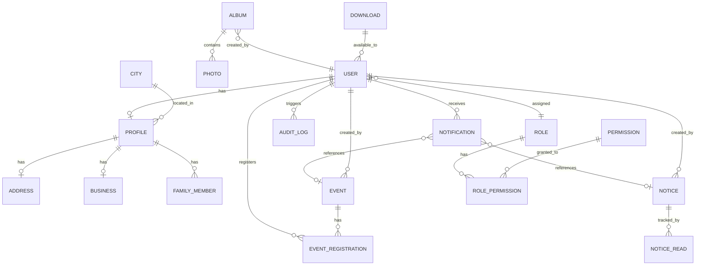

### 8.2 Table Definitions

#### `users`

| Column | Type | Constraints | Description |
|---|---|---|---|
| id | UUID | PK, DEFAULT uuid_generate_v4() | Internal user ID |
| clerk_id | VARCHAR(255) | UNIQUE, NOT NULL | Clerk.com external user ID |
| email | VARCHAR(255) | UNIQUE, NOT NULL | User email |
| mobile | VARCHAR(15) | UNIQUE, NOT NULL | Mobile number |
| full_name | VARCHAR(100) | NOT NULL | Display name |
| member_id | VARCHAR(20) | UNIQUE | System-generated member ID (MYS/XXXXX) |
| role_id | UUID | FK → roles.id, NOT NULL | Assigned role |
| status | ENUM | NOT NULL, DEFAULT 'PENDING' | PENDING, ACTIVE, DEACTIVATED, REJECTED |
| profile_complete | BOOLEAN | DEFAULT FALSE | Profile completion flag |
| avatar_url | TEXT | | Cloudinary URL for profile photo |
| expo_push_token | TEXT | | Expo push notification token |
| last_login_at | TIMESTAMP | | Last login timestamp |
| created_at | TIMESTAMP | DEFAULT NOW() | Account creation |
| updated_at | TIMESTAMP | DEFAULT NOW() | Last update |

**Indexes:** `idx_users_email`, `idx_users_mobile`, `idx_users_clerk_id`, `idx_users_status`, `idx_users_role_id`

---

#### `roles`

| Column | Type | Constraints | Description |
|---|---|---|---|
| id | UUID | PK | Role ID |
| name | VARCHAR(50) | UNIQUE, NOT NULL | GUEST, MEMBER, VOLUNTEER, EXECUTIVE, ADMIN, SUPER_ADMIN |
| display_name | VARCHAR(100) | NOT NULL | Human-readable name |
| description | TEXT | | Role description |
| is_system | BOOLEAN | DEFAULT FALSE | System roles cannot be deleted |
| created_at | TIMESTAMP | DEFAULT NOW() | |
| updated_at | TIMESTAMP | DEFAULT NOW() | |

---

#### `permissions`

| Column | Type | Constraints | Description |
|---|---|---|---|
| id | UUID | PK | Permission ID |
| name | VARCHAR(100) | UNIQUE, NOT NULL | e.g., members.view, events.create |
| module | VARCHAR(50) | NOT NULL | Feature module |
| action | VARCHAR(50) | NOT NULL | VIEW, CREATE, UPDATE, DELETE, APPROVE, EXPORT, IMPORT, MANAGE |
| description | TEXT | | |

---

#### `role_permissions`

| Column | Type | Constraints | Description |
|---|---|---|---|
| id | UUID | PK | |
| role_id | UUID | FK → roles.id, NOT NULL | |
| permission_id | UUID | FK → permissions.id, NOT NULL | |
| created_at | TIMESTAMP | DEFAULT NOW() | |

**Unique Constraint:** (role_id, permission_id)

---

#### `profiles`

| Column | Type | Constraints | Description |
|---|---|---|---|
| id | UUID | PK | |
| user_id | UUID | FK → users.id, UNIQUE, NOT NULL | One-to-one |
| date_of_birth | DATE | | |
| gender | ENUM | | MALE, FEMALE, OTHER |
| blood_group | VARCHAR(5) | | |
| bio | TEXT | | Short bio |
| created_at | TIMESTAMP | DEFAULT NOW() | |
| updated_at | TIMESTAMP | DEFAULT NOW() | |

---

#### `addresses`

| Column | Type | Constraints | Description |
|---|---|---|---|
| id | UUID | PK | |
| profile_id | UUID | FK → profiles.id, UNIQUE | One-to-one |
| street | TEXT | | Street address |
| city_id | UUID | FK → cities.id | |
| state | VARCHAR(100) | | |
| pin_code | VARCHAR(6) | | |
| country | VARCHAR(50) | DEFAULT 'India' | |
| created_at | TIMESTAMP | DEFAULT NOW() | |
| updated_at | TIMESTAMP | DEFAULT NOW() | |

---

#### `cities`

| Column | Type | Constraints | Description |
|---|---|---|---|
| id | UUID | PK | |
| name | VARCHAR(100) | UNIQUE, NOT NULL | City name |
| state | VARCHAR(100) | | State |
| is_active | BOOLEAN | DEFAULT TRUE | Show in filter |
| sort_order | INT | DEFAULT 0 | Display order |

---

#### `businesses`

| Column | Type | Constraints | Description |
|---|---|---|---|
| id | UUID | PK | |
| profile_id | UUID | FK → profiles.id, UNIQUE | One-to-one |
| occupation_type | VARCHAR(100) | | |
| company_name | VARCHAR(200) | | |
| designation | VARCHAR(100) | | |
| business_category | VARCHAR(100) | | |
| business_address | TEXT | | |
| created_at | TIMESTAMP | DEFAULT NOW() | |
| updated_at | TIMESTAMP | DEFAULT NOW() | |

---

#### `family_members`

| Column | Type | Constraints | Description |
|---|---|---|---|
| id | UUID | PK | |
| profile_id | UUID | FK → profiles.id, NOT NULL | |
| relation | VARCHAR(50) | NOT NULL | SPOUSE, FATHER, MOTHER, CHILD, SIBLING |
| name | VARCHAR(100) | NOT NULL | |
| date_of_birth | DATE | | |
| created_at | TIMESTAMP | DEFAULT NOW() | |
| updated_at | TIMESTAMP | DEFAULT NOW() | |

---

#### `events`

| Column | Type | Constraints | Description |
|---|---|---|---|
| id | UUID | PK | |
| title | VARCHAR(200) | NOT NULL | Event name |
| description | TEXT | | Rich text description |
| date | DATE | NOT NULL | Event date |
| start_time | TIME | NOT NULL | Start time |
| end_time | TIME | | End time |
| venue | VARCHAR(200) | NOT NULL | Venue name |
| address | TEXT | | Full address |
| latitude | DECIMAL(10,8) | | For maps |
| longitude | DECIMAL(11,8) | | For maps |
| banner_url | TEXT | | Cloudinary URL |
| organizer | VARCHAR(200) | | Organizer name |
| registration_deadline | TIMESTAMP | | Last date to register |
| max_registrations | INT | | Cap, NULL = unlimited |
| status | ENUM | NOT NULL, DEFAULT 'DRAFT' | DRAFT, PUBLISHED, CANCELLED |
| category | VARCHAR(50) | | Event category |
| created_by | UUID | FK → users.id | |
| published_at | TIMESTAMP | | When published |
| created_at | TIMESTAMP | DEFAULT NOW() | |
| updated_at | TIMESTAMP | DEFAULT NOW() | |

**Indexes:** `idx_events_date`, `idx_events_status`, `idx_events_created_by`

---

#### `event_registrations`

| Column | Type | Constraints | Description |
|---|---|---|---|
| id | UUID | PK | |
| event_id | UUID | FK → events.id, NOT NULL | |
| user_id | UUID | FK → users.id, NOT NULL | |
| status | ENUM | DEFAULT 'REGISTERED' | REGISTERED, CANCELLED, ATTENDED |
| registered_at | TIMESTAMP | DEFAULT NOW() | |
| cancelled_at | TIMESTAMP | | |

**Unique Constraint:** (event_id, user_id)
**Indexes:** `idx_eventreg_event`, `idx_eventreg_user`

---

#### `notices`

| Column | Type | Constraints | Description |
|---|---|---|---|
| id | UUID | PK | |
| title | VARCHAR(200) | NOT NULL | |
| content | TEXT | NOT NULL | Rich text |
| category | ENUM | NOT NULL | GENERAL, IMPORTANT, CIRCULAR |
| is_pinned | BOOLEAN | DEFAULT FALSE | Pinned to top |
| attachment_url | TEXT | | Cloudinary URL |
| published_at | TIMESTAMP | | |
| scheduled_at | TIMESTAMP | | Future publish date |
| status | ENUM | DEFAULT 'DRAFT' | DRAFT, PUBLISHED |
| created_by | UUID | FK → users.id | |
| created_at | TIMESTAMP | DEFAULT NOW() | |
| updated_at | TIMESTAMP | DEFAULT NOW() | |

**Indexes:** `idx_notices_category`, `idx_notices_status`, `idx_notices_published_at`

---

#### `notice_reads`

| Column | Type | Constraints | Description |
|---|---|---|---|
| id | UUID | PK | |
| notice_id | UUID | FK → notices.id | |
| user_id | UUID | FK → users.id | |
| read_at | TIMESTAMP | DEFAULT NOW() | |

**Unique Constraint:** (notice_id, user_id)

---

#### `albums`

| Column | Type | Constraints | Description |
|---|---|---|---|
| id | UUID | PK | |
| name | VARCHAR(200) | NOT NULL | Album title |
| description | TEXT | | |
| category | ENUM | NOT NULL | EVENTS, CELEBRATIONS, OTHERS |
| cover_url | TEXT | | Cloudinary URL for cover |
| photo_count | INT | DEFAULT 0 | Denormalized count |
| created_by | UUID | FK → users.id | |
| created_at | TIMESTAMP | DEFAULT NOW() | |
| updated_at | TIMESTAMP | DEFAULT NOW() | |

**Indexes:** `idx_albums_category`

---

#### `photos`

| Column | Type | Constraints | Description |
|---|---|---|---|
| id | UUID | PK | |
| album_id | UUID | FK → albums.id, NOT NULL | |
| url | TEXT | NOT NULL | Cloudinary URL |
| thumbnail_url | TEXT | | Cloudinary thumbnail |
| caption | VARCHAR(200) | | |
| sort_order | INT | DEFAULT 0 | Display order |
| uploaded_by | UUID | FK → users.id | |
| created_at | TIMESTAMP | DEFAULT NOW() | |

**Indexes:** `idx_photos_album`

---

#### `notifications`

| Column | Type | Constraints | Description |
|---|---|---|---|
| id | UUID | PK | |
| user_id | UUID | FK → users.id, NOT NULL | Recipient |
| title | VARCHAR(200) | NOT NULL | |
| message | TEXT | NOT NULL | |
| type | ENUM | NOT NULL | EVENT, NOTICE, REGISTRATION, SYSTEM, GALLERY |
| reference_type | VARCHAR(50) | | Entity type (event, notice, etc.) |
| reference_id | UUID | | Entity ID |
| is_read | BOOLEAN | DEFAULT FALSE | |
| read_at | TIMESTAMP | | |
| created_at | TIMESTAMP | DEFAULT NOW() | |

**Indexes:** `idx_notif_user`, `idx_notif_read`, `idx_notif_created`

---

#### `audit_logs`

| Column | Type | Constraints | Description |
|---|---|---|---|
| id | UUID | PK | |
| actor_id | UUID | FK → users.id | Who performed action |
| action | VARCHAR(100) | NOT NULL | e.g., user.approve, event.create |
| target_type | VARCHAR(50) | | Entity type |
| target_id | UUID | | Entity ID |
| details | JSONB | | Change details |
| ip_address | VARCHAR(45) | | |
| user_agent | TEXT | | |
| created_at | TIMESTAMP | DEFAULT NOW() | |

**Indexes:** `idx_audit_actor`, `idx_audit_action`, `idx_audit_created`

---

#### `downloads`

| Column | Type | Constraints | Description |
|---|---|---|---|
| id | UUID | PK | |
| title | VARCHAR(200) | NOT NULL | |
| description | TEXT | | |
| file_url | TEXT | NOT NULL | Cloudinary URL |
| file_type | VARCHAR(20) | | PDF, DOC, etc. |
| file_size | INT | | Size in bytes |
| is_active | BOOLEAN | DEFAULT TRUE | |
| created_by | UUID | FK → users.id | |
| created_at | TIMESTAMP | DEFAULT NOW() | |

---

#### `app_settings`

| Column | Type | Constraints | Description |
|---|---|---|---|
| id | UUID | PK | |
| key | VARCHAR(100) | UNIQUE, NOT NULL | Setting key |
| value | TEXT | | Setting value |
| type | VARCHAR(20) | | STRING, JSON, BOOLEAN, NUMBER |
| updated_by | UUID | FK → users.id | |
| updated_at | TIMESTAMP | DEFAULT NOW() | |

---

## 9. API Planning

### 9.1 API Design Principles

- **Base URL:** `/api/v1`
- **Format:** JSON
- **Authentication:** Bearer token (Clerk JWT) in `Authorization` header
- **Versioning:** URL-based (`/api/v1`, `/api/v2`)
- **Pagination:** Cursor-based for lists. Query params: `page`, `limit`, `cursor`
- **Sorting:** Query param `sort=field:asc|desc`
- **Filtering:** Query params per field (e.g., `status=ACTIVE&city=Ranchi`)
- **Error Format:**

```json
{
  "success": false,
  "error": {
    "code": "ERR_VALIDATION",
    "message": "Validation failed",
    "details": [
      { "field": "email", "message": "Email is already registered" }
    ]
  }
}
```

### 9.2 Authentication Endpoints

| Method | Endpoint | Auth | Description |
|---|---|---|---|
| POST | `/api/v1/auth/register` | Public | Register new user |
| POST | `/api/v1/auth/login` | Public | Login (delegated to Clerk) |
| POST | `/api/v1/auth/logout` | Bearer | Logout, invalidate session |
| POST | `/api/v1/auth/forgot-password` | Public | Trigger password reset via Clerk |
| GET | `/api/v1/auth/me` | Bearer | Get current user info |
| PUT | `/api/v1/auth/push-token` | Bearer | Update Expo push token |

#### POST `/api/v1/auth/register`

**Request:**
```json
{
  "fullName": "Rajesh Kumar",
  "email": "rajesh@example.com",
  "mobile": "9876543210",
  "password": "SecurePass123"
}
```

**Response (201):**
```json
{
  "success": true,
  "data": {
    "id": "uuid",
    "memberId": "MYS/01234",
    "status": "PENDING",
    "message": "Registration submitted. Pending admin approval."
  }
}
```

**Error Codes:**
| Code | HTTP | Message |
|---|---|---|
| ERR_DUPLICATE_EMAIL | 409 | Email is already registered |
| ERR_DUPLICATE_MOBILE | 409 | Mobile number is already registered |
| ERR_VALIDATION | 422 | Validation failed |
| ERR_CLERK | 500 | Authentication provider error |

---

### 9.3 User / Profile Endpoints

| Method | Endpoint | Auth | Description |
|---|---|---|---|
| GET | `/api/v1/users/me` | Bearer | Get own full profile |
| PUT | `/api/v1/users/me` | Bearer | Update own profile |
| PUT | `/api/v1/users/me/avatar` | Bearer | Upload/update avatar |
| PUT | `/api/v1/users/me/personal` | Bearer | Update personal info |
| PUT | `/api/v1/users/me/address` | Bearer | Update address |
| PUT | `/api/v1/users/me/business` | Bearer | Update business details |
| POST | `/api/v1/users/me/family` | Bearer | Add family member |
| PUT | `/api/v1/users/me/family/:id` | Bearer | Update family member |
| DELETE | `/api/v1/users/me/family/:id` | Bearer | Remove family member |

#### GET `/api/v1/users/me`

**Response (200):**
```json
{
  "success": true,
  "data": {
    "id": "uuid",
    "memberId": "MYS/01234",
    "fullName": "Rajesh Kumar",
    "email": "rajesh@example.com",
    "mobile": "9876543210",
    "avatarUrl": "https://res.cloudinary.com/...",
    "status": "ACTIVE",
    "role": "MEMBER",
    "profileComplete": true,
    "profile": {
      "dateOfBirth": "1990-05-15",
      "gender": "MALE",
      "bloodGroup": "O+",
      "address": { "street": "...", "city": "Ranchi", "state": "Jharkhand", "pinCode": "834001" },
      "business": { "occupationType": "Business", "companyName": "..." },
      "familyMembers": []
    }
  }
}
```

---

### 9.4 Member Directory Endpoints

| Method | Endpoint | Auth | Description |
|---|---|---|---|
| GET | `/api/v1/members` | Public / Bearer | List members (guest=limited, member=full) |
| GET | `/api/v1/members/:id` | Public / Bearer | Get member detail |

#### GET `/api/v1/members`

**Query Parameters:**

| Param | Type | Default | Description |
|---|---|---|---|
| page | int | 1 | Page number |
| limit | int | 20 | Per page (max 50) |
| search | string | — | Search by name |
| city | string | — | Filter by city name |
| sort | string | name:asc | Sort field and direction |

**Response (200):**
```json
{
  "success": true,
  "data": {
    "members": [
      {
        "id": "uuid",
        "fullName": "Amit Maheshwari",
        "avatarUrl": "...",
        "city": "Jaipur",
        "state": "Rajasthan",
        "occupation": "Business"
      }
    ],
    "pagination": {
      "page": 1,
      "limit": 20,
      "total": 245,
      "totalPages": 13,
      "hasNext": true
    }
  }
}
```

---

### 9.5 Events Endpoints

| Method | Endpoint | Auth | Description |
|---|---|---|---|
| GET | `/api/v1/events` | Public | List events |
| GET | `/api/v1/events/:id` | Public | Event detail |
| POST | `/api/v1/events` | Bearer (Admin+) | Create event |
| PUT | `/api/v1/events/:id` | Bearer (Admin+) | Update event |
| PATCH | `/api/v1/events/:id/status` | Bearer (Admin+) | Change status |
| DELETE | `/api/v1/events/:id` | Bearer (Super Admin) | Delete event |
| POST | `/api/v1/events/:id/register` | Bearer | Register for event |
| DELETE | `/api/v1/events/:id/register` | Bearer | Cancel registration |
| GET | `/api/v1/events/:id/registrations` | Bearer (Admin+) | List registrations |
| GET | `/api/v1/events/:id/registrations/export` | Bearer (Admin+) | Export as CSV |

#### GET `/api/v1/events`

**Query Parameters:**

| Param | Type | Default | Description |
|---|---|---|---|
| page | int | 1 | Page number |
| limit | int | 10 | Per page |
| status | string | — | UPCOMING, ONGOING, COMPLETED, CANCELLED |
| search | string | — | Search by title |
| from | date | — | Start date filter |
| to | date | — | End date filter |

---

### 9.6 Notices Endpoints

| Method | Endpoint | Auth | Description |
|---|---|---|---|
| GET | `/api/v1/notices` | Bearer | List notices |
| GET | `/api/v1/notices/:id` | Bearer | Notice detail |
| POST | `/api/v1/notices` | Bearer (Admin+) | Create notice |
| PUT | `/api/v1/notices/:id` | Bearer (Admin+) | Update notice |
| DELETE | `/api/v1/notices/:id` | Bearer (Admin+) | Delete notice |
| POST | `/api/v1/notices/:id/read` | Bearer | Mark notice as read |

---

### 9.7 Gallery Endpoints

| Method | Endpoint | Auth | Description |
|---|---|---|---|
| GET | `/api/v1/albums` | Bearer | List albums |
| GET | `/api/v1/albums/:id` | Bearer | Album detail with photos |
| POST | `/api/v1/albums` | Bearer (Admin+) | Create album |
| PUT | `/api/v1/albums/:id` | Bearer (Admin+) | Update album |
| DELETE | `/api/v1/albums/:id` | Bearer (Admin+) | Delete album |
| POST | `/api/v1/albums/:id/photos` | Bearer (Admin+) | Upload photos (multipart) |
| DELETE | `/api/v1/albums/:id/photos/:photoId` | Bearer (Admin+) | Delete photo |

---

### 9.8 Notifications Endpoints

| Method | Endpoint | Auth | Description |
|---|---|---|---|
| GET | `/api/v1/notifications` | Bearer | List user's notifications |
| PATCH | `/api/v1/notifications/:id/read` | Bearer | Mark as read |
| PATCH | `/api/v1/notifications/read-all` | Bearer | Mark all as read |
| GET | `/api/v1/notifications/unread-count` | Bearer | Get unread count |

---

### 9.9 Admin Endpoints

| Method | Endpoint | Auth | Description |
|---|---|---|---|
| GET | `/api/v1/admin/dashboard` | Bearer (Admin+) | Dashboard KPIs |
| GET | `/api/v1/admin/users` | Bearer (Admin+) | List all users |
| POST | `/api/v1/admin/users` | Bearer (Admin+) | Create user |
| PUT | `/api/v1/admin/users/:id` | Bearer (Admin+) | Edit user |
| PATCH | `/api/v1/admin/users/:id/approve` | Bearer (Admin+) | Approve registration |
| PATCH | `/api/v1/admin/users/:id/reject` | Bearer (Admin+) | Reject registration |
| PATCH | `/api/v1/admin/users/:id/activate` | Bearer (Admin+) | Activate user |
| PATCH | `/api/v1/admin/users/:id/deactivate` | Bearer (Admin+) | Deactivate user |
| PATCH | `/api/v1/admin/users/:id/role` | Bearer (Super Admin) | Change role |
| POST | `/api/v1/admin/users/:id/reset-password` | Bearer (Admin+) | Reset password |
| DELETE | `/api/v1/admin/users/:id` | Bearer (Super Admin) | Delete user |
| POST | `/api/v1/admin/users/import` | Bearer (Super Admin) | Bulk CSV import |
| GET | `/api/v1/admin/users/export` | Bearer (Admin+) | Export CSV/Excel |
| GET | `/api/v1/admin/reports/member-growth` | Bearer (Admin+) | Member growth data |
| GET | `/api/v1/admin/reports/event-attendance` | Bearer (Admin+) | Event attendance |
| GET | `/api/v1/admin/reports/city-distribution` | Bearer (Admin+) | City-wise distribution |
| GET | `/api/v1/admin/audit-logs` | Bearer (Super Admin) | Audit logs |
| GET | `/api/v1/admin/settings` | Bearer (Super Admin) | Get settings |
| PUT | `/api/v1/admin/settings` | Bearer (Super Admin) | Update settings |

#### GET `/api/v1/admin/dashboard`

**Response (200):**
```json
{
  "success": true,
  "data": {
    "totalMembers": 1245,
    "upcomingEvents": 18,
    "notices": 25,
    "galleryImages": 320,
    "newRegistrations": 34,
    "memberGrowth": {
      "thisMonth": 12,
      "lastMonth": 8,
      "trend": "UP"
    },
    "memberGrowthChart": [
      { "month": "Jan", "count": 980 },
      { "month": "Feb", "count": 1020 }
    ],
    "recentActivities": [
      {
        "id": "uuid",
        "type": "MEMBER_APPROVED",
        "message": "New member Amit Maheshwari approved",
        "timestamp": "2026-07-25T10:30:00Z"
      }
    ]
  }
}
```

---

### 9.10 Utility Endpoints

| Method | Endpoint | Auth | Description |
|---|---|---|---|
| GET | `/api/v1/cities` | Public | List active cities |
| GET | `/api/v1/downloads` | Bearer | List available downloads |
| GET | `/api/v1/about` | Public | About us content |
| GET | `/api/v1/contact` | Public | Contact information |
| GET | `/api/v1/health` | Public | Health check |

---

### 9.11 Socket.io Events

| Event | Direction | Payload | Description |
|---|---|---|---|
| `connect` | Client → Server | `{ token }` | Authenticate socket |
| `notification:new` | Server → Client | `{ id, title, message, type }` | New notification |
| `notification:count` | Server → Client | `{ unreadCount }` | Updated unread count |
| `member:approved` | Server → Client | `{ userId }` | Registration approved |
| `event:published` | Server → Broadcast | `{ eventId, title }` | New event published |
| `notice:published` | Server → Broadcast | `{ noticeId, title }` | New notice published |
| `gallery:new` | Server → Broadcast | `{ albumId, name }` | New album added |

---

## 10. Security

### 10.1 Authentication

| Aspect | Implementation |
|---|---|
| **Provider** | Clerk.com (managed authentication) |
| **Token Type** | JWT (issued by Clerk) |
| **Token Storage (Mobile)** | Expo SecureStore (encrypted keychain/keystore) |
| **Token Storage (Web)** | HttpOnly cookie (Clerk handles) |
| **Session Duration** | 7 days (configurable in Clerk) |
| **Refresh** | Automatic token refresh via Clerk SDK |

### 10.2 Authorization

| Aspect | Implementation |
|---|---|
| **Model** | Role-Based Access Control (RBAC) |
| **Roles** | GUEST, MEMBER, VOLUNTEER, EXECUTIVE, ADMIN, SUPER_ADMIN |
| **Middleware** | Express middleware validates JWT + checks role against permission matrix |
| **Route Protection** | Every API route specifies minimum required role |
| **Frontend** | Role-aware navigation — screens/buttons hidden for unauthorized roles |

### 10.3 Data Protection

| Aspect | Implementation |
|---|---|
| **Passwords** | Managed by Clerk (bcrypt, salted) |
| **Data in Transit** | HTTPS/TLS 1.2+ (enforce in production) |
| **Data at Rest** | PostgreSQL disk encryption (Docker volume) |
| **PII** | Personal data encrypted at application level for sensitive fields (mobile, email) |
| **JWT Validation** | Clerk public key verification on every API request |
| **SQL Injection** | Prisma ORM parameterized queries |
| **XSS** | React auto-escaping + DOMPurify for rich text |
| **CSRF** | Clerk handles for web; not applicable for mobile API |

### 10.4 Rate Limiting

| Endpoint Category | Limit |
|---|---|
| Auth (login, register, forgot-password) | 5 requests / 15 minutes per IP |
| Public API (members, events listing) | 100 requests / minute per IP |
| Authenticated API | 200 requests / minute per user |
| File Upload | 10 requests / minute per user |
| Admin Bulk Operations | 5 requests / minute per user |

### 10.5 Password Policy (via Clerk)

- Minimum 8 characters
- At least 1 uppercase letter
- At least 1 number
- No common passwords (Clerk's built-in dictionary)
- Account lockout after 5 failed attempts (15 min cooldown)

### 10.6 Session Management

- JWT expiry: 1 hour (short-lived)
- Refresh token expiry: 7 days
- Single device enforcement: Not enforced for MVP (user can be logged in on multiple devices)
- Logout invalidates refresh token
- Token rotation on refresh

### 10.7 Audit Logging

All administrative actions are logged to `audit_logs` table:

| Action Category | Events Logged |
|---|---|
| User Management | approve, reject, activate, deactivate, delete, role_change, password_reset |
| Event Management | create, update, publish, cancel, delete |
| Notice Management | create, update, publish, delete |
| Gallery Management | album_create, album_delete, photo_upload, photo_delete |
| Settings | settings_update, role_permission_change |
| Auth | login_success, login_failure, logout |

### 10.8 OWASP Top 10 Mitigation

| Risk | Mitigation |
|---|---|
| A01 Broken Access Control | RBAC middleware on all routes, permission checks |
| A02 Cryptographic Failures | TLS, Clerk-managed passwords, no plaintext secrets |
| A03 Injection | Prisma ORM parameterized queries |
| A04 Insecure Design | Threat modeling, input validation, least privilege |
| A05 Security Misconfiguration | Helmet.js, CORS whitelist, env-based config |
| A06 Vulnerable Components | Regular npm audit, dependabot |
| A07 Authentication Failures | Clerk.com managed auth, rate limiting, lockout |
| A08 Data Integrity Failures | Input validation, sanitization |
| A09 Logging Failures | Structured audit logs, monitoring |
| A10 SSRF | No user-controlled URLs in backend requests |

---

## 11. Notifications

### 11.1 Notification Channels

| Channel | Technology | MVP | Use Case |
|---|---|---|---|
| Push (Mobile) | Expo Push Notifications via Socket.io | ✅ | Real-time alerts |
| In-App | Socket.io + Notifications screen | ✅ | Notification history |
| Email | Clerk transactional emails | ✅ | Password reset, welcome |
| SMS | Deferred | ❌ | Phase 2 |

### 11.2 Trigger Events & Templates

| ID | Trigger | Channel | Priority | Template |
|---|---|---|---|---|
| N-01 | New Registration Submitted | Push (Admin) | High | "New registration: {name}. Tap to review." |
| N-02 | Registration Approved | Push + In-App | High | "Welcome to MYS CONNECT! Your registration has been approved." |
| N-03 | Registration Rejected | Push + In-App | High | "Registration update: Your registration was not approved. {reason}" |
| N-04 | New Event Published | Push + In-App (All Members) | Medium | "New event: {eventName} on {date}. Tap to view details." |
| N-05 | Event Updated | Push + In-App (Registrants) | Medium | "Event updated: {eventName}. Tap to see changes." |
| N-06 | Event Cancelled | Push + In-App (Registrants) | High | "Event cancelled: {eventName}. {reason}" |
| N-07 | Event Reminder (24h before) | Push | Medium | "Reminder: {eventName} is tomorrow at {time}." |
| N-08 | Event Registration Confirmed | In-App | Low | "You're registered for {eventName}." |
| N-09 | New Notice Published | Push + In-App (All Members) | Medium | "New notice: {noticeTitle}. Tap to read." |
| N-10 | New Gallery Album | Push + In-App (All Members) | Low | "New photos: {albumName}. Tap to view." |
| N-11 | Profile Incomplete Reminder | Push (7 days after registration) | Low | "Complete your profile to get the most out of MYS CONNECT." |
| N-12 | Account Deactivated | Push + In-App | High | "Your account has been deactivated. Contact admin for details." |
| N-13 | Password Reset | Email (Clerk) | High | Clerk default template |

### 11.3 Notification Scheduling

| Schedule Type | Implementation |
|---|---|
| Immediate | Socket.io emit on trigger |
| Scheduled (Event reminders) | Cron job checks events 24h before, queues notifications |
| Delayed (Profile reminder) | Cron job checks incomplete profiles older than 7 days |

---

## 12. File Management

### 12.1 Storage Strategy

| Component | Storage | Format |
|---|---|---|
| Profile Photos | Cloudinary | JPEG/PNG, auto-format WebP |
| Event Banners | Cloudinary | JPEG/PNG |
| Gallery Photos | Cloudinary | JPEG/PNG, auto-format WebP |
| Notice Attachments | Cloudinary | PDF, JPEG, PNG |
| Downloads | Cloudinary | PDF, DOC, DOCX |
| Album Covers | Cloudinary (derived from first photo or uploaded) | JPEG |

### 12.2 Upload Limits

| Category | Max Size | Max Dimensions | Formats |
|---|---|---|---|
| Profile Photo | 5 MB | 2000×2000 px | JPEG, PNG |
| Event Banner | 10 MB | 1920×1080 px | JPEG, PNG |
| Gallery Photo | 10 MB | 4000×4000 px | JPEG, PNG, WebP |
| Notice Attachment | 10 MB | — | PDF, JPEG, PNG |
| Download File | 25 MB | — | PDF, DOC, DOCX, XLS, XLSX |
| Batch Upload (Gallery) | 50 photos max per request | — | — |

### 12.3 Image Processing (Cloudinary Transformations)

| Use Case | Transformation |
|---|---|
| Profile Thumbnail | `w_150,h_150,c_fill,g_face,f_auto,q_auto` |
| Profile Display | `w_400,h_400,c_fill,g_face,f_auto,q_auto` |
| Event Banner (Mobile) | `w_800,h_400,c_fill,f_auto,q_auto` |
| Event Banner (Web) | `w_1200,h_600,c_fill,f_auto,q_auto` |
| Gallery Thumbnail | `w_300,h_300,c_fill,f_auto,q_auto` |
| Gallery Full | `w_1200,f_auto,q_auto` |
| Album Cover | `w_400,h_300,c_fill,f_auto,q_auto` |

### 12.4 Naming Convention

```
mys/{entity}/{entityId}/{purpose}_{timestamp}.{ext}
```

Examples:
- `mys/users/uuid/avatar_1720000000.jpg`
- `mys/events/uuid/banner_1720000000.jpg`
- `mys/albums/uuid/photo_001_1720000000.jpg`

---

## 13. Offline Support

### 13.1 Strategy

MVP implements **read-only offline caching** — users can browse previously loaded data without network. All write operations require connectivity.

### 13.2 Cached Data

| Data | Cache Strategy | TTL |
|---|---|---|
| Member Directory (list) | Cache first 100 members | 24 hours |
| Member Detail (viewed) | Cache on view | 24 hours |
| Events List | Cache all loaded events | 12 hours |
| Event Detail (viewed) | Cache on view | 12 hours |
| Notices List | Cache all loaded notices | 6 hours |
| Gallery Albums | Cache album list | 24 hours |
| Gallery Photos (viewed) | Image cache via React Native Fast Image | 7 days |
| Notifications | Cache last 50 | 1 hour |
| Profile (own) | Always cached | Until update |
| Cities List | Always cached | 30 days |

### 13.3 Implementation

| Aspect | Technology |
|---|---|
| API Response Cache | React Query (TanStack Query) with `staleTime` and `cacheTime` |
| Image Cache | Expo Image / React Native Fast Image |
| Persistent Storage | AsyncStorage / MMKV for critical data |
| Cache Invalidation | On pull-to-refresh, on login, on notification receipt |

### 13.4 Offline Behavior

| Scenario | Behavior |
|---|---|
| App opens offline | Show cached data with "Offline" banner |
| User tries to register for event | Show "You're offline. Please connect to register." |
| User tries to update profile | Show "You're offline. Changes will not be saved." |
| Pull-to-refresh offline | Show "Unable to refresh. Check your connection." |
| Network restored | Auto-refresh current screen data |

### 13.5 Conflict Resolution

Write operations are not queued offline in MVP. If a user attempts a write while offline, a clear error message is shown. No sync conflicts are expected.

---

## 14. Performance Requirements

### 14.1 Targets

| Metric | Target | Maximum |
|---|---|---|
| App Launch to Splash | < 1 second | 2 seconds |
| Splash to First Screen | < 2 seconds | 4 seconds |
| API Response (list endpoints) | < 500ms (p95) | 2 seconds |
| API Response (detail endpoints) | < 300ms (p95) | 1 second |
| Image Loading (thumbnails) | < 500ms | 2 seconds |
| Image Loading (full) | < 2 seconds | 5 seconds |
| Screen Transition | < 300ms | 500ms |
| Search Results | < 500ms | 1 second |
| Push Notification Delivery | < 5 seconds | 30 seconds |

### 14.2 Optimization Strategies

| Strategy | Implementation |
|---|---|
| **Pagination** | 20 items per page for members, 10 for events, 20 for notifications |
| **Infinite Scroll** | FlatList with `onEndReached` at threshold 0.5 |
| **Lazy Loading** | Images loaded on scroll into viewport |
| **Image Optimization** | Cloudinary auto-format (WebP), quality auto, responsive sizing |
| **API Caching** | React Query with 5-minute stale time for lists |
| **Bundle Size** | Expo tree-shaking, lazy route loading |
| **Database** | Indexed columns (see Section 8), query optimization |
| **Connection Pooling** | Prisma connection pool (min 2, max 10) |
| **Debounced Search** | 300ms debounce on search inputs |
| **Skeleton Loading** | Skeleton screens during data fetch |

---

## 15. Accessibility

### 15.1 Standards

Target: **WCAG 2.1 Level AA** compliance.

### 15.2 Implementation

| Requirement | Implementation |
|---|---|
| **Color Contrast** | Minimum 4.5:1 for normal text, 3:1 for large text. Maroon (#800000) on white meets 4.5:1. |
| **Font Scaling** | Support system font scaling up to 200%. Use `sp` units in React Native. |
| **Touch Targets** | Minimum 44×44 dp tap targets for all interactive elements |
| **Screen Readers** | `accessibilityLabel` and `accessibilityHint` on all interactive elements |
| **Focus Order** | Logical tab order following visual layout |
| **Alt Text** | All images have `accessibilityLabel` descriptions |
| **Error Identification** | Errors announced to screen readers, associated with form fields |
| **Motion** | Respect `prefers-reduced-motion` system setting |
| **Keyboard Navigation (Web)** | Full keyboard navigability for admin dashboard |
| **Semantic HTML (Web)** | Proper heading hierarchy, ARIA landmarks, semantic elements |

---

## 16. Non-Functional Requirements

### 16.1 Availability

| Metric | Target |
|---|---|
| Uptime | 99.5% (allows ~43 hours downtime/year) |
| Planned Maintenance Window | Saturdays 2:00–5:00 AM IST |
| Incident Response | < 4 hours for critical issues |

### 16.2 Reliability

| Metric | Target |
|---|---|
| API Error Rate | < 1% of requests |
| Data Consistency | Strong consistency for writes, eventual for caches |
| Data Durability | No data loss — PostgreSQL WAL + daily backups |

### 16.3 Scalability

| Dimension | Current | Target (12 months) |
|---|---|---|
| Concurrent Users | 50 | 500 |
| Total Members | 1,000 | 5,000 |
| Events/Year | 30 | 100 |
| Gallery Photos | 1,000 | 10,000 |
| API Requests/Minute | 100 | 1,000 |

### 16.4 Maintainability

| Aspect | Practice |
|---|---|
| Code Style | ESLint + Prettier enforced |
| Type Safety | TypeScript for frontend and backend |
| Documentation | JSDoc for functions, README for each module |
| Dependency Updates | Monthly review, automated with npm audit |
| Modular Architecture | Feature-based folder structure |

### 16.5 Observability

| Aspect | Tool (MVP) |
|---|---|
| Application Logs | Console logging with structured JSON (Winston) |
| Error Tracking | Console errors + future Sentry integration |
| API Monitoring | Request/response logging middleware |
| Uptime Monitoring | Manual / future UptimeRobot |
| Performance | React Native Performance API + Lighthouse (web) |

### 16.6 Backup & Disaster Recovery

| Aspect | Strategy |
|---|---|
| Database Backup | Daily automated pg_dump to local directory |
| Backup Retention | 30 days rolling |
| Recovery Time Objective (RTO) | < 4 hours |
| Recovery Point Objective (RPO) | < 24 hours |
| Backup Testing | Monthly restore test |
| Media (Cloudinary) | Cloudinary maintains redundant copies; no local backup needed |

---

## 17. Admin Dashboard Specification

### 17.1 Dashboard Home

Based on wireframe screen 11:

#### KPI Cards (Top Row)

| Card | Value | Subtext | Color |
|---|---|---|---|
| Total Members | 1,245 | ↑ 12 this month | Primary (Maroon) |
| Upcoming Events | 18 | ↑ 3 this month | Accent |
| Notices | 25 | ↑ 5 this month | Accent |
| Gallery Images | 320 | ↑ 22 this month | Accent |
| New Registrations | 34 | ↑ 8 this month | Highlight |

#### Member Growth Chart

- Type: Line chart (recharts or Chart.js)
- X-axis: Months (Jan–Dec)
- Y-axis: Total members
- Period selector: "This Year" dropdown
- Data: Monthly cumulative member count

#### Recent Activities Feed

- Chronological list of recent admin actions
- Each entry: Icon, Description, Timestamp
- Examples: "New member Amit Maheshwari approved", "New event 'Blood Donation Camp' added", "New notice 'Office Closed' published", "Gallery image uploaded in 'Diwali Milan'"
- "View All →" link to full activity log

#### Members Panel (Right Side)

- Shows top 5 recent members
- Each: Avatar, Name, City, Status badge (Active/Inactive)
- "View All →" link to full Members page

### 17.2 Layout

| Element | Specification |
|---|---|
| Sidebar | Fixed left, 260px width, collapsible to 60px (icon only) |
| Header | Fixed top, 64px height, shows admin name, avatar, role badge, notification bell |
| Content Area | Fluid, responsive, padding 24px |
| Breakpoints | Desktop: ≥1024px (sidebar visible), Tablet: 768–1023px (sidebar collapsible), Mobile: <768px (sidebar overlay) |

### 17.3 Admin Sub-Pages

Each management page follows a consistent pattern:

| Component | Description |
|---|---|
| Page Header | Title, breadcrumb, primary action button (e.g., "Add Member") |
| Filters Bar | Search input, status dropdown, date range, city filter |
| Data Table | Sortable columns, row selection, action buttons |
| Pagination | Page numbers, per-page selector (10/20/50), total count |
| Detail/Edit Modal | Slide-in panel or modal for create/edit forms |
| Empty State | Illustration + "No {items} found" + CTA |
| Loading State | Skeleton table rows |

---

## 18. UI Guidelines

### 18.1 Color Palette (Derived from Wireframe & Logo)

| Token | Color | Hex | Usage |
|---|---|---|---|
| Primary | Deep Maroon | `#800020` | Headers, buttons, active nav, links |
| Primary Dark | Dark Maroon | `#5C0015` | Pressed states, header background |
| Primary Light | Light Maroon | `#A0334D` | Hover states |
| Secondary | Cream/Gold | `#F5F0E6` | Backgrounds, cards |
| Accent | Warm Gold | `#C8A951` | Highlights, badges, decorative |
| Background | Off-White | `#FAFAFA` | App background |
| Surface | White | `#FFFFFF` | Cards, modals |
| Text Primary | Dark Charcoal | `#1A1A1A` | Body text |
| Text Secondary | Gray | `#666666` | Captions, placeholders |
| Text Tertiary | Light Gray | `#999999` | Disabled text |
| Success | Green | `#22C55E` | Active badge, success states |
| Warning | Amber | `#F59E0B` | Pending badge, warnings |
| Error | Red | `#EF4444` | Errors, delete, destructive |
| Info | Blue | `#3B82F6` | Info states, links |
| Border | Light Gray | `#E5E5E5` | Dividers, borders |

### 18.2 Typography

| Element | Font | Weight | Size (Mobile) | Size (Web) |
|---|---|---|---|---|
| App Title | Poppins | Bold (700) | 24sp | 28px |
| Screen Title | Poppins | SemiBold (600) | 20sp | 24px |
| Section Title | Poppins | SemiBold (600) | 16sp | 18px |
| Body | Inter | Regular (400) | 14sp | 14px |
| Body Bold | Inter | Medium (500) | 14sp | 14px |
| Caption | Inter | Regular (400) | 12sp | 12px |
| Button | Inter | SemiBold (600) | 14sp | 14px |
| Input Label | Inter | Medium (500) | 12sp | 13px |
| Tab Label | Inter | Medium (500) | 13sp | 14px |
| Badge | Inter | Bold (700) | 10sp | 11px |

### 18.3 Spacing System

Base unit: 4px

| Token | Value | Usage |
|---|---|---|
| xs | 4px | Icon padding, tight spacing |
| sm | 8px | Inline spacing, between chips |
| md | 12px | Section padding, card internal padding |
| lg | 16px | Screen padding (horizontal), between sections |
| xl | 24px | Between major sections |
| 2xl | 32px | Screen padding (vertical), major gaps |
| 3xl | 48px | Hero sections |

### 18.4 Component Specifications

#### Buttons

| Type | Style |
|---|---|
| Primary | Maroon background, white text, rounded corners (8px), height 48px |
| Secondary | White background, maroon border, maroon text |
| Ghost | Transparent, maroon text |
| Destructive | Red background, white text |
| Disabled | Gray background, light gray text, no interaction |

#### Cards

| Property | Value |
|---|---|
| Border Radius | 12px |
| Shadow | `0 2px 8px rgba(0,0,0,0.08)` |
| Padding | 16px |
| Background | White |
| Border | None (or 1px `#E5E5E5` for subtle distinction) |

#### Member Card (List Item)

| Element | Spec |
|---|---|
| Layout | Row: Avatar (48px circle) + Text stack + Chevron right |
| Avatar | 48×48, circular, `c_fill,g_face` |
| Name | Body Bold, Text Primary |
| Subtitle | Caption, Text Secondary (City, State + line break + Profession) |
| Divider | 1px `#F0F0F0` between items |
| Tap Area | Full row |

#### Event Card

| Element | Spec |
|---|---|
| Layout | Row: Date badge (left) + Text stack (right) |
| Date Badge | 48×60 box, day (24sp Bold) + month (12sp uppercase, Maroon text on cream bg) |
| Event Name | Body Bold |
| Date/Time | Caption, Text Secondary |
| Venue | Caption, Text Secondary |
| Register Button | Small primary button (optional) |

#### Filter Chips

| Property | Value |
|---|---|
| Height | 32px |
| Padding | 12px horizontal |
| Border Radius | 16px (pill) |
| Active | Maroon background, white text |
| Inactive | White background, gray border, gray text |
| Scrollable | Horizontal ScrollView |

#### Tab Bar

| Property | Value |
|---|---|
| Height | 44px |
| Active Tab | Maroon text, bottom border 2px Maroon |
| Inactive Tab | Gray text, no border |
| Style | Underline variant |

### 18.5 States

| State | Treatment |
|---|---|
| **Loading** | Skeleton screens matching content layout. Shimmer animation. |
| **Empty** | Centered illustration (line art) + title + subtitle + optional CTA button |
| **Error** | Error illustration + message + "Retry" button |
| **Offline** | Top banner: "You're offline" with dismiss. Content from cache. |
| **Pull-to-Refresh** | Maroon spinner, standard pull-to-refresh behavior |
| **Infinite Scroll Loading** | Spinner at bottom of list |

### 18.6 Animations & Transitions

| Animation | Spec |
|---|---|
| Screen Transitions | Stack: slide from right (300ms). Tab: fade (200ms). |
| Button Press | Scale 0.96 + opacity 0.8 (100ms) |
| Card Press | Opacity 0.7 (100ms) |
| Skeleton Shimmer | Linear gradient sweep, 1.5s loop |
| Toast Notification | Slide from top, auto-dismiss 3 seconds |
| Modal | Fade in + slide up (300ms) |
| Tab Indicator | Slide animation (200ms ease-out) |
| Badge Count | Scale bounce when count changes |

### 18.7 Dark Mode

Dark mode is **out of scope for MVP**. The design system tokens should be structured to support future dark mode addition:

| Token | Light | Dark (Future) |
|---|---|---|
| Background | `#FAFAFA` | `#121212` |
| Surface | `#FFFFFF` | `#1E1E1E` |
| Text Primary | `#1A1A1A` | `#E0E0E0` |
| Text Secondary | `#666666` | `#A0A0A0` |
| Border | `#E5E5E5` | `#333333` |

---

## 19. Error Handling

### 19.1 Error Classification

| Category | Code Prefix | HTTP Status | User Impact |
|---|---|---|---|
| Validation | ERR_VALIDATION | 400/422 | Correctable by user |
| Authentication | ERR_AUTH | 401 | Re-login required |
| Authorization | ERR_FORBIDDEN | 403 | Feature blocked |
| Not Found | ERR_NOT_FOUND | 404 | Navigate back |
| Conflict | ERR_CONFLICT | 409 | Duplicate data |
| Rate Limit | ERR_RATE_LIMIT | 429 | Wait and retry |
| Server | ERR_SERVER | 500 | Retry or contact support |
| Network | ERR_NETWORK | — (client) | Check connection |
| Timeout | ERR_TIMEOUT | 408 | Retry |

### 19.2 Error Messages & Handling

#### Validation Errors

| Field | Error Condition | Message |
|---|---|---|
| Name | Empty | "Name is required" |
| Name | Too short | "Name must be at least 2 characters" |
| Email | Invalid format | "Enter a valid email address" |
| Email | Duplicate | "This email is already registered" |
| Mobile | Invalid format | "Enter a valid 10-digit mobile number" |
| Mobile | Duplicate | "This mobile number is already registered" |
| Password | Too short | "Password must be at least 8 characters" |
| Password | Missing uppercase | "Password must contain at least 1 uppercase letter" |
| Password | Missing number | "Password must contain at least 1 number" |
| Confirm Password | Mismatch | "Passwords do not match" |
| Date of Birth | Future date | "Date of birth cannot be in the future" |
| Date of Birth | Under 18 | "You must be at least 18 years old" |
| Pin Code | Invalid | "Enter a valid 6-digit pin code" |
| Profile Photo | Too large | "Image must be less than 5 MB" |
| Profile Photo | Wrong format | "Only JPEG and PNG images are allowed" |

#### API Errors

| Scenario | User Message | Action |
|---|---|---|
| 401 Unauthorized | "Session expired. Please log in again." | Navigate to Login, clear local session |
| 403 Forbidden | "You don't have permission to perform this action." | Dismiss dialog |
| 404 Not Found | "The requested content is not available." | Navigate back |
| 409 Conflict (duplicate registration) | "You're already registered for this event." | Dismiss |
| 429 Rate Limited | "Too many requests. Please wait a moment." | Auto-retry after delay |
| 500 Server Error | "Something went wrong. Please try again later." | Show retry button |
| Network Error | "No internet connection. Please check your network." | Show retry button or offline banner |
| Timeout | "Request timed out. Please try again." | Show retry button |

#### Offline Errors

| Scenario | Message | UI |
|---|---|---|
| App opened offline | "You're offline. Showing cached data." | Top banner (dismissible) |
| Write attempt offline | "This action requires an internet connection." | Toast |
| Pull-to-refresh offline | "Can't refresh while offline." | Toast |

#### Permission Errors

| Scenario | Message |
|---|---|
| Guest tries to register for event | "Please log in to register for events." |
| Member tries admin action | "You don't have permission for this action." |
| Deactivated user tries to login | "Your account has been deactivated. Contact admin." |
| Pending user tries to login | "Your registration is pending admin approval." |

---

## 20. Testing Strategy

### 20.1 Testing Pyramid

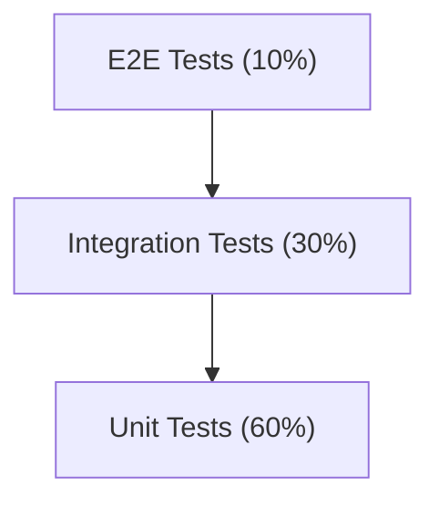

### 20.2 Unit Testing

| Layer | Tool | Coverage Target |
|---|---|---|
| Frontend Components | Jest + React Native Testing Library | 70% |
| Backend Services | Jest + Supertest | 80% |
| Utility Functions | Jest | 90% |
| Prisma Models | Jest (with mock) | 80% |

**Focus Areas:**
- Form validation logic
- Permission checking utilities
- Date formatting helpers
- Search/filter logic
- Business rule functions (status transitions, notification triggers)

### 20.3 Integration Testing

| Area | Tool | Coverage |
|---|---|---|
| API Endpoints | Supertest + Jest | All endpoints |
| Database Operations | Jest + Prisma (test DB) | All CRUD operations |
| Authentication Flow | Clerk test mode + Jest | Login, register, token refresh |
| Socket.io Events | Socket.io-client + Jest | All event types |

### 20.4 End-to-End Testing

| Area | Tool | Test Cases |
|---|---|---|
| Mobile App | Detox (Expo) | Critical user journeys |
| Admin Dashboard | Cypress / Playwright | All admin workflows |

**Critical E2E Flows:**
1. Guest → Browse Members → Browse Events
2. Register → Wait for Approval → Login → View Home
3. Login → Search Members → View Detail
4. Login → Browse Events → Register for Event
5. Login → View Gallery → Open Album → View Photo
6. Login → View Notices → Read Notice
7. Admin → Approve Registration → Member Notification
8. Admin → Create Event → Publish → Member Notification
9. Admin → Create Notice → Publish
10. Admin → Upload Gallery → Members See Album

### 20.5 Performance Testing

| Test | Tool | Criteria |
|---|---|---|
| API Load Test | Artillery / k6 | 100 concurrent users, p95 < 500ms |
| Image Loading | Manual + Lighthouse | LCP < 2.5s (web) |
| App Launch | Manual profiling | Cold start < 3s |
| Database Query | EXPLAIN ANALYZE | No full table scans on indexed queries |

### 20.6 Security Testing

| Test | Tool/Method |
|---|---|
| Dependency Vulnerabilities | npm audit, Snyk |
| API Authentication | Manual test: unauthorized access to protected routes |
| SQL Injection | Automated: sqlmap against API |
| XSS | Manual: inject script tags in all text inputs |
| RBAC | Manual: test every role against every endpoint |

### 20.7 UAT Acceptance Checklist

| # | Feature | Status |
|---|---|---|
| 1 | Guest can browse members (limited view) | ☐ |
| 2 | Guest can browse events | ☐ |
| 3 | User can register for an account | ☐ |
| 4 | Admin can approve/reject registration | ☐ |
| 5 | Approved member can log in | ☐ |
| 6 | Member home shows greeting, events, quick access | ☐ |
| 7 | Member can search and filter members | ☐ |
| 8 | Member can view member detail with contact actions | ☐ |
| 9 | Member can browse events by status tab | ☐ |
| 10 | Member can register for an event | ☐ |
| 11 | Member can browse gallery albums and photos | ☐ |
| 12 | Member can read notices by category | ☐ |
| 13 | Member receives push notifications | ☐ |
| 14 | Member can view and edit profile (all sections) | ☐ |
| 15 | Member can change password | ☐ |
| 16 | Member can log out | ☐ |
| 17 | Admin dashboard shows correct KPIs | ☐ |
| 18 | Admin can manage members (CRUD + approve/reject) | ☐ |
| 19 | Admin can manage events (CRUD + publish/cancel) | ☐ |
| 20 | Admin can manage notices (CRUD + publish) | ☐ |
| 21 | Admin can manage gallery (albums + photos) | ☐ |
| 22 | Admin can view reports with charts | ☐ |
| 23 | Admin can export data (CSV/Excel) | ☐ |
| 24 | Offline mode shows cached data gracefully | ☐ |
| 25 | All error states display correctly | ☐ |

---

## 21. Future Roadmap

### Phase 1 — MVP (Current Scope)

**Timeline:** 8–12 weeks

| Feature | Priority |
|---|---|
| Authentication (Clerk) | P0 |
| Registration with approval flow | P0 |
| Member Directory (search + filter) | P0 |
| Member Profile management | P0 |
| Events (list + detail + registration) | P0 |
| Gallery (albums + photos) | P0 |
| Notices (categorized) | P0 |
| Push Notifications (Expo + Socket.io) | P0 |
| Guest Mode | P0 |
| Admin Dashboard (KPIs + management) | P0 |

### Phase 2 — Engagement & Growth

**Timeline:** 4–6 months post-MVP

| Feature | Description |
|---|---|
| Donations / Payments | UPI/Razorpay integration for event fees, donations |
| In-App Chat | 1-to-1 and group messaging between members |
| SMS OTP Login | OTP-based login as alternative to password |
| Multi-language (Hindi/English) | i18n support |
| Advanced Reports | Exportable PDF reports, email scheduled reports |
| Event Attendance | QR code check-in, attendance tracking |
| Member Birthday Reminders | Automated birthday notifications |
| Dark Mode | Full dark mode theme support |
| Video in Gallery | Video upload and playback |

### Phase 3 — Scale & Intelligence

**Timeline:** 6–12 months post-MVP

| Feature | Description |
|---|---|
| Multi-Chapter Support | Multi-tenancy for MYS chapters across cities |
| Blood Donation Registry | Searchable blood donor database |
| Matrimonial Section | Member profiles for matchmaking (community feature) |
| Discussion Forum | Community forum for discussions |
| Cloud Hosting Migration | AWS/GCP deployment with auto-scaling |
| CI/CD Pipeline | GitHub Actions / GitLab CI |
| Analytics Integration | Mixpanel / Firebase Analytics |
| Error Monitoring | Sentry integration |

### Nice-to-Have / Future AI Features

| Feature | Description |
|---|---|
| Smart Member Recommendations | AI-powered member discovery based on business/interests |
| Auto-Generated Event Summaries | AI summarizes event outcomes from photos + attendance |
| Intelligent Search | NLP-based search across members, events, notices |
| Chatbot | AI assistant for common queries (event dates, contacts) |
| Sentiment Analysis | Gauge community engagement from notification interactions |
| Auto-Translation | Real-time Hindi ↔ English translation for notices |

---

## 22. Risks

### 22.1 Technical Risks

| ID | Risk | Probability | Impact | Mitigation |
|---|---|---|---|---|
| TR-01 | Clerk.com free tier rate limits exceeded | Medium | High | Monitor usage, plan upgrade path, implement caching |
| TR-02 | Cloudinary free tier storage exceeded | Medium | Medium | Monitor usage, compress aggressively, plan upgrade |
| TR-03 | Expo push notifications unreliable on certain Android OEMs | High | Medium | Implement Socket.io fallback, in-app notification center |
| TR-04 | Local Docker PostgreSQL data loss | Medium | Critical | Daily backups, document recovery procedure |
| TR-05 | Socket.io connection drops on mobile | Medium | Low | Auto-reconnect logic, fallback to polling |
| TR-06 | App performance on low-end Android devices | High | Medium | Performance profiling, image optimization, lazy loading |
| TR-07 | Expo SDK breaking changes on upgrade | Low | Medium | Pin SDK version, test upgrades in staging |

### 22.2 Business Risks

| ID | Risk | Probability | Impact | Mitigation |
|---|---|---|---|---|
| BR-01 | Low member adoption | Medium | High | Involve leadership in launch, in-person onboarding, seed content early |
| BR-02 | Admin overwhelmed with approval queue | Medium | Medium | Bulk approval, auto-approve after verification (Phase 2) |
| BR-03 | Stale content (no new events/notices) | Medium | High | Assign content responsibility to specific executives |
| BR-04 | Data quality issues (incorrect member info) | High | Medium | Validation rules, admin review, self-service profile editing |
| BR-05 | Privacy concerns with member directory | Low | High | Privacy settings (Phase 2), display only consented information |

### 22.3 Operational Risks

| ID | Risk | Probability | Impact | Mitigation |
|---|---|---|---|---|
| OR-01 | Single developer dependency | High | Critical | Document everything, code reviews, knowledge sharing |
| OR-02 | No staging environment | High | Medium | Set up Docker Compose for local staging |
| OR-03 | No automated testing initially | High | Medium | Add tests incrementally, prioritize critical paths |
| OR-04 | No monitoring in production | High | Medium | Add basic health checks, error logging from day 1 |
| OR-05 | App store rejection (iOS) | Medium | High | Follow Apple guidelines, prepare screenshots, privacy policy |

---

## 23. Open Questions

The following items could not be definitively determined from the provided wireframe, logo, or existing PRD notes. These must be resolved with stakeholders before development begins.

| ID | Question | Impact | Default Assumption |
|---|---|---|---|
| OQ-01 | **Is registration open to anyone, or only invited members?** The PRD notes say "depending on final business process." | Registration flow, admin workload | Open registration with admin approval |
| OQ-02 | **What cities should appear in the Member Directory filter?** Wireframe shows Jaipur, Jodhpur, Kota, Udaipur. Are these fixed or dynamic? Should Ranchi be included? | Member directory UX | Dynamic — admin-managed city list. Ranchi included. |
| OQ-03 | **Should members be able to see other members' contact details (phone, email)?** Privacy implications. | Member detail screen, privacy policy | Yes, for authenticated members only. Guest sees no contact info. |
| OQ-04 | **Is the Volunteer role needed for MVP?** The wireframe shows no volunteer-specific screens. | RBAC, development scope | Include role in DB, but no volunteer-specific features for MVP. |
| OQ-05 | **Who can create events — only Admin, or Executive too?** | Permission matrix, workflow | Executives can create/edit. Only Admin+ can publish/cancel. |
| OQ-06 | **Is event registration mandatory or optional per event?** Some events may be open (no RSVP). | Event creation form, event detail | Optional per event. Admin decides during event creation. |
| OQ-07 | **Should gallery uploads send push notifications to all members?** Could be noisy. | Notification frequency, UX | Yes for new albums. Not for adding photos to existing albums. |
| OQ-08 | **What is the member ID format?** Wireframe shows "MYS/01234". Is this auto-generated or assigned? | User registration, member ID generation | Auto-generated sequential: MYS/XXXXX |
| OQ-09 | **Should the Downloads section contain specific documents?** What kind of documents? | Downloads feature, content strategy | Admin uploads organizational documents (forms, brochures, bylaws). |
| OQ-10 | **Is there an existing member database to import?** Will admin seed data or will members self-register? | Launch plan, data migration | Combination: admin seeds initial members + new members self-register. |
| OQ-11 | **Should the Admin Dashboard be accessible only on web, or also on mobile?** Wireframe shows web only. | Dashboard development scope | Web only (Next.js). Admin uses mobile app as a member. |
| OQ-12 | **What is the organization's privacy policy regarding member data?** Required for app store submission. | Legal, app store compliance | Organization must provide privacy policy before app store submission. |
| OQ-13 | **Are there existing social media pages to link from the About Us section?** | About us content | Include placeholder links, admin configures. |
| OQ-14 | **Should the "Learn More" button on Guest Home hero banner link to an external website or in-app About page?** | Navigation flow | In-app About Us page. |
| OQ-15 | **Is SMS notification required for MVP?** Clerk supports it on paid plans. | Notification strategy, cost | No SMS for MVP. Push + in-app only. |
| OQ-16 | **What are the event categories?** Wireframe doesn't explicitly show categories. | Event filtering | Social, Cultural, Educational, Sports, Community Service, Other |
| OQ-17 | **Should members be able to share event/notice content externally (WhatsApp, etc.)?** | Feature scope, content sharing | Yes, via native share sheet (share URL or text). |
| OQ-18 | **Is there a requirement for member "Family Details" beyond name and relation?** The wireframe shows it as a section. | Profile schema, forms | Name, Relation, DOB — minimal for MVP. |
| OQ-19 | **What CI/CD, Analytics, and Monitoring tools should be used?** Marked as placeholders in tech stack. | DevOps setup | CI/CD: GitHub Actions (Phase 2). Analytics: Firebase Analytics (Phase 2). Monitoring: UptimeRobot (Phase 2). |
| OQ-20 | **Does the hamburger menu (drawer) on Guest Home contain any items?** The wireframe shows it but the content isn't visible. | Navigation | Drawer contains: Home, Members, Events, About Us, Contact Us, Login. |

---

## Appendix A: Technology Stack Summary

| Layer | Technology | Version |
|---|---|---|
| Mobile Framework | Expo (React Native) | SDK 52+ |
| Mobile Language | TypeScript | 5.x |
| State Management | React Query (TanStack) + Zustand | Latest |
| Navigation | Expo Router / React Navigation | Latest |
| Admin Dashboard | Next.js | 14+ |
| Admin UI Library | shadcn/ui (Radix + Tailwind) | Latest |
| Backend Runtime | Node.js | 20 LTS |
| Backend Framework | Express.js | 4.x |
| ORM | Prisma | 5.x |
| Database | PostgreSQL | 16 |
| Containerization | Docker + Docker Compose | Latest |
| Authentication | Clerk.com | Latest |
| File Storage | Cloudinary | — |
| Realtime | Socket.io | 4.x |
| Push Notifications | Expo Push Notifications | — |
| Charts (Admin) | Recharts / Chart.js | Latest |
| Form Validation | Zod + React Hook Form | Latest |
| HTTP Client | Axios | Latest |
| Image Loading | Expo Image | Latest |

---

## Appendix B: Glossary

| Term | Definition |
|---|---|
| MYS | Maheshwari Yuva Sangathan — the community youth organization |
| Member | A registered, approved user of the platform |
| Guest | An unauthenticated visitor with limited access |
| Executive | Organization office bearer (President, Secretary, etc.) |
| KPI | Key Performance Indicator |
| RBAC | Role-Based Access Control |
| CTA | Call to Action |
| MVP | Minimum Viable Product |
| ORM | Object-Relational Mapping |
| JWT | JSON Web Token |
| WAL | Write-Ahead Logging (PostgreSQL) |
| PII | Personally Identifiable Information |
| CRUD | Create, Read, Update, Delete |

---

*End of Document*

*This PRD is a living document and will be updated as decisions are made on open questions, features are refined, and development progresses.*
