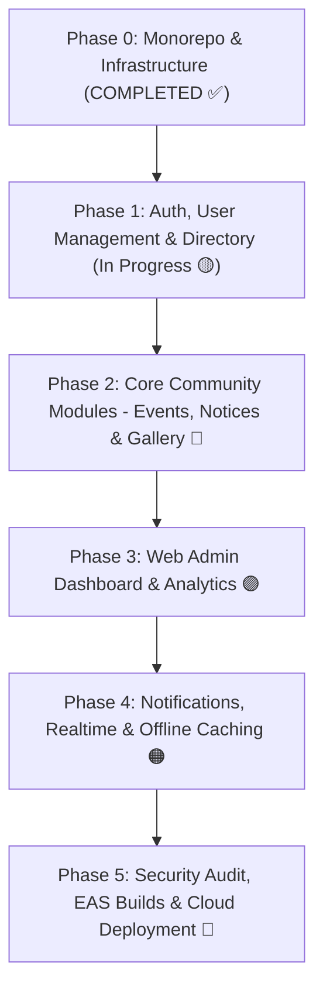

# MYS CONNECT — Enterprise Implementation Roadmap

This document presents the **exhaustive, phase-by-phase development path** for **MYS CONNECT** (Maheshwari Yuva Sangathan, Ranchi). Every task is directly mapped 1-to-1 to the requirements, database schemas, API specs, RBAC rules, and user flows documented in [PRD.md](file:///d:/mys/PRD.md).

---

## 📊 High-Level Phase Overview

---

## 🟢 PHASE 0: Infrastructure, Database & Monorepo Setup (**COMPLETED ✅**)

- [x] **0.1 Monorepo Workspace**: Root `package.json` with npm workspaces (`apps/mobile`, `server`, `apps/admin`, `packages/shared`), `.gitignore`, `README.md`.
- [x] **0.2 Docker Database Infrastructure**: PostgreSQL 16 container (`mys_postgres`) running on port `5433` (`mys_db`).
- [x] **0.3 Database Schema (Prisma ORM)**: All 16 models defined and synced via `prisma db push` (`User`, `Profile`, `City`, `Event`, `EventRSVP`, `EventPhoto`, `Notice`, `Album`, `AlbumPhoto`, `Notification`, `PushToken`, `AppSetting`, `AuditLog`, and 10 enums).
- [x] **0.4 Database Seeding**: Executed `prisma db seed` — seeded 9 Jharkhand cities and 13 application settings.
- [x] **0.5 Mobile App Setup**: Created Expo SDK 57 + Expo Router app at `apps/mobile` with `@clerk/expo` and `expo-secure-store`.
- [x] **0.6 Design System**: Configured `Colors.ts` (Maroon `#6B1D2A` & Gold `#D4A041`), `Typography.ts`, `Spacing.ts` (4px grid), and barrel `theme.ts` per PRD Section 18.
- [x] **0.7 Express Backend Server**: TypeScript server with Helmet security, CORS, Winston logger, and rate limiters.
- [x] **0.8 Admin Web App**: Next.js App Router project initialized at `apps/admin/`.
- [x] **0.9 Clerk CLI & Agent Skills**: Installed Clerk CLI, linked `apps/admin` to Clerk App `app_3GzbvkdN91NfTO2oRhgvjKqSPT8`, configured Next.js proxy matcher (`/__clerk/:path*`), and installed `clerk/skills` and `cloudinary-devs/skills`.
- [x] **0.10 Git & GitHub Repository**: Initialized root Git repo, configured strict `.env` secret exclusion, and published to single monorepo at [https://github.com/CypherNinjaa/mys-connect](https://github.com/CypherNinjaa/mys-connect).

---

## 🟡 PHASE 1: Authentication, User Management & Member Directory

### Milestone 1.1: Backend User & Auth Sync API (**COMPLETED ✅**)
- [x] **Clerk Webhook Synchronization**: Endpoint `POST /api/v1/webhooks/clerk` with Svix header verification handling `user.created`, `user.updated`, and `user.deleted` events.
- [x] **Clerk User Ban / Unban API**: Created `clerk.ts` incorporating `clerkClient.users.banUser()` and `clerkClient.users.unbanUser()`.
- [x] **Prisma User Status Enforcement**:
  - Admin changing user status to `DEACTIVATED` or `REJECTED` automatically triggers Clerk user ban and locks DB access.
  - Admin changing user status to `ACTIVE` unbans the user in Clerk and enables full member permissions.
- [x] **User Profile API**:
  - `GET /api/v1/users/me` — Fetches current user profile & approval status.
  - `POST /api/v1/users/register` — Saves 4-step member profile (Personal, Location, Cultural, Professional).
  - `GET /api/v1/users/cities` — Returns active Jharkhand cities for dropdown selects.
- [x] **Admin User Management API**:
  - `GET /api/v1/admin/users` — Paginated user listing with search, city filter, and status filter (`PENDING`, `ACTIVE`, `DEACTIVATED`).
  - `POST /api/v1/admin/users/:id/status` — Approve, Reject, Ban/Deactivate, or Unban users with audit logging.
  - `POST /api/v1/admin/users/:id/role` — Update user roles (`SUPER_ADMIN`, `ADMIN`, `MODERATOR`, `MEMBER`).

### Milestone 1.2: Mobile Authentication & Registration UI (**COMPLETED ✅**)
- [x] **Splash & Route Guard (`src/app/index.tsx`)**: Auto-checks Clerk auth state & Prisma DB status:
  - Unauthenticated -> `(auth)/sign-in`
  - Incomplete profile -> `(auth)/complete-profile`
  - `PENDING` approval -> `(auth)/pending-approval`
  - `DEACTIVATED`/`REJECTED` -> `(auth)/deactivated`
  - `ACTIVE` member -> `(member)/home`
- [x] **Sign In Screen (`src/app/(auth)/sign-in.tsx`)**: High-grade UI with MYS Ranchi branding, input validation, password toggle, and `@clerk/expo` `useSignIn` integration.
- [x] **Sign Up Screen (`src/app/(auth)/sign-up.tsx`)**: Email & password registration with 6-digit OTP email verification code modal using `useSignUp`.
- [x] **Complete Profile Screen (`src/app/(auth)/complete-profile.tsx`)**: 4-step step-by-step registration form:
  - Step 1: Personal (First Name, Last Name, Phone, Gender, Blood Group, DOB).
  - Step 2: Address & Location (City dropdown from `/users/cities`, Address, Pincode).
  - Step 3: Cultural & Family (Father's Name, Gotra, Native Place).
  - Step 4: Professional Profile (Occupation, Organization, Designation).
- [x] **Pending Approval Screen (`src/app/(auth)/pending-approval.tsx`)**: Screen showing application under review by MYS admins with a status refresh check.
- [x] **Deactivated Screen (`src/app/(auth)/deactivated.tsx`)**: Screen displayed when user access is banned or declined.
- [x] **Member Shell & Dashboard (`src/app/(member)/`)**:
  - Bottom Tab bar (Home, Directory, Events, Notices, Profile).
  - Home screen dashboard with *Jai Shree Krishna* banner, user city badge, quick action grid, announcements, and MYS Motto (`सेवा · त्याग · सदाचार`).
  - Profile screen displaying member info, gotra, city, status badge, and sign out button.

### Milestone 1.3: Member Directory & Search (NEXT UP 🔜)
- [ ] **Backend Directory Search & Filter Endpoint**:
  - `GET /api/v1/members`: Paginated member listing with multi-field search (Name, Gotra, Occupation, Native Place), City filter, Blood Group filter, and sort options.
  - `GET /api/v1/members/:id`: Detailed public profile view for individual members.
- [ ] **Mobile Member Directory Screen (`src/app/(member)/directory.tsx`)**:
  - Top search bar with debounced input.
  - Filter modal (City dropdown, Occupation filter, Blood group selector).
  - Virtualized `FlatList` with pull-to-refresh & infinite scroll pagination.
  - Member Card Component: Avatar, Full Name, Gotra, City badge, Blood Group badge, Occupation.
- [ ] **Mobile Member Profile Detail Screen (`src/app/member/[id].tsx`)**:
  - Detailed card view with Father's name, Native place, Business details.
  - Quick action buttons: **Call** (`tel:`), **WhatsApp** (`whatsapp://send`), and **Email** (`mailto:`).

### Milestone 1.4: Guest Mode & Conversion Flow
- [ ] **Guest Onboarding**: Allow browsing guest mode without signing in (per PRD FR-01 & FR-03).
- [ ] **Guest Directory View**: Limited directory access (showing Name & City only; hiding phone, address, and contact actions).
- [ ] **Guest Join CTA Banner**: Sticky bottom bar encouraging guests to sign up & register as full members.

---

## 🔵 PHASE 2: Core Community Modules (Events, Notices & Gallery)

### Milestone 2.1: Community Events Module
- [ ] **Backend Event API**:
  - `GET /api/v1/events` — List events with filters (Upcoming, Past, Category).
  - `GET /api/v1/events/:id` — Event detail with venue coordinates, attendee count, RSVP list.
  - `POST /api/v1/events/:id/rsvp` — RSVP action (`GOING`, `NOT_GOING`, `MAYBE`).
  - `POST /api/v1/admin/events` — Create/edit event (Admin only).
- [ ] **Mobile Events Screen (`src/app/(member)/events.tsx`)**:
  - Segmented control toggle: **Upcoming Events** vs **Past Events**.
  - Event Card: Cover image, title, date/time badge, venue, RSVP status indicator.
- [ ] **Mobile Event Detail Screen (`src/app/event/[id].tsx`)**:
  - High-res cover image, event description, organizer contact info.
  - Dynamic RSVP Action buttons with optimistic UI updates.
  - "Open in Maps" button linking to Google Maps / Apple Maps venue location.

### Milestone 2.2: Notice Board & Announcements
- [ ] **Backend Notice API**:
  - `GET /api/v1/notices` — List active notices sorted by pinned status & published date.
  - `POST /api/v1/admin/notices` — Publish notice with priority (`LOW`, `MEDIUM`, `HIGH`, `CRITICAL`) and pin flag.
- [ ] **Mobile Notice Board Screen (`src/app/(member)/notices.tsx`)**:
  - Feed view with priority badge tags (e.g. Red for Urgent, Gold for Announcements).
  - Pinned Notice Carousel at the top of the feed.
  - Notice Detail Modal with attachment preview & download trigger.

### Milestone 2.3: Photo Gallery & Albums (Cloudinary Powered)
- [ ] **Backend Gallery API**:
  - `GET /api/v1/albums` — Album grid with cover photo and photo count.
  - `GET /api/v1/albums/:id` — Photo gallery grid within an album.
  - Cloudinary upload signature generation for secure admin uploads.
- [ ] **Mobile Gallery Screen (`src/app/(member)/gallery.tsx`)**:
  - Album grid layout with category chips (Events, Celebrations, Service).
  - Fullscreen Lightbox Viewer with pinch-to-zoom and swipe navigation.

---

## 🟣 PHASE 3: Web Admin Dashboard (`apps/admin`)

### Milestone 3.1: Admin Analytics & Verification Dashboard
- [ ] **Overview Metrics Dashboard (`src/app/admin/dashboard/page.tsx`)**:
  - Analytics KPI cards: Total Members, Pending Approvals, Monthly Active Users, Upcoming Events.
  - Quick action widgets for pending verifications.
- [ ] **Member Verification & Management (`src/app/admin/members/page.tsx`)**:
  - Data table with sorting, search, and status tabs (`PENDING`, `ACTIVE`, `DEACTIVATED`, `REJECTED`).
  - Member verification modal to inspect full profile details (Gotra, Native Place, Address, Contact).
  - One-click **Approve**, **Reject**, **Ban (Deactivate)**, or **Unban** buttons integrated with backend API.
  - Role management (Assign `ADMIN` or `MODERATOR`).

### Milestone 3.2: Content Management Editors
- [ ] **Event Manager (`src/app/admin/events/page.tsx`)**: Form to create/edit events with cover photo upload, date-time pickers, and venue address maps.
- [ ] **Notice Publisher (`src/app/admin/notices/page.tsx`)**: Rich text notice editor with priority selector and pin-to-top toggle.
- [ ] **Gallery Manager (`src/app/admin/albums/page.tsx`)**: Album creator with drag-and-drop multi-photo uploader powered by Cloudinary.
- [ ] **Audit Trail Viewer (`src/app/admin/audit-logs/page.tsx`)**: Log table tracking all admin status changes, role edits, and content deletions.

---

## 🟠 PHASE 4: Push Notifications, Realtime & Offline Caching

### Milestone 4.1: Expo Push Notifications & In-App Notification Center
- [ ] **Push Notification Engine**:
  - Register Expo Push Token on mobile app launch (`POST /api/v1/notifications/push-token`).
  - Backend notification dispatcher for:
    - **Registration Approved / Rejected**: Alert sent to individual member.
    - **Urgent Notice**: Broadcast push notification to all active members.
    - **Event Reminder**: Scheduled push notification 24 hours before event start.
- [ ] **In-App Notification Center (`src/app/notifications.tsx`)**:
  - Unread badge counter on mobile app header.
  - Notification history list with mark-as-read action.

### Milestone 4.2: Socket.io Realtime Sync
- [ ] Initialize Socket.io server on Express backend.
- [ ] Connect Socket.io client in mobile app for instant notice alerts and live RSVP count updates.

### Milestone 4.3: Offline Caching & Performance
- [ ] **Offline Caching Layer**: Implement `@react-native-async-storage/async-storage` cache for Member Directory, Events, and Notices.
- [ ] **Image Optimization**: Integrate `expo-image` with Cloudinary dynamic URL transformations (`f_auto,q_auto,w_400`) for low bandwidth consumption.

---

## 🔴 PHASE 5: Security Audit, Testing, EAS Builds & Cloud Deployment

### Milestone 5.1: Security & Compliance Audit
- [ ] Verify OWASP Top 10 mitigations (CORS, Rate Limiting, Input Sanitization with Zod).
- [ ] Audit RBAC middleware enforcement across all Express routes and Next.js admin pages.

### Milestone 5.2: Backend Production Docker Deployment
- [ ] Create production `Dockerfile` for Express backend server.
- [ ] Configure production `docker-compose.prod.yml` with SSL certificate termination & NGINX reverse proxy.

### Milestone 5.3: EAS Build & Mobile Distribution
- [ ] Configure `eas.json` for Expo Application Services (EAS).
- [ ] Build Android APK / AAB binary for Google Play Store / direct distribution.
- [ ] Build iOS IPA for Apple TestFlight / App Store submission.

---

## 📌 Milestone Status Matrix

| Phase | Milestone | Focus | Status |
|---|---|---|---|
| **Phase 0** | 0.1 – 0.10 | Infrastructure, Prisma, Docker, Expo, Clerk, GitHub Repo | **COMPLETED ✅** |
| **Phase 1** | 1.1 | Backend User API & Clerk Ban/Unban Sync | **COMPLETED ✅** |
| **Phase 1** | 1.2 | Mobile Auth, 4-Step Profile Form, Status Screens | **COMPLETED ✅** |
| **Phase 1** | 1.3 | Member Directory API, Filters, Detail Screens with Call/WhatsApp | **NEXT UP 🔜** |
| **Phase 1** | 1.4 | Guest Mode Onboarding & Conversion Banner | Pending |
| **Phase 2** | 2.1 | Events Module (RSVP, Maps, Attendee Lists) | Pending |
| **Phase 2** | 2.2 | Notice Board (Priority Tags, Pinned Banner) | Pending |
| **Phase 2** | 2.3 | Photo Gallery & Albums (Cloudinary Lightbox) | Pending |
| **Phase 3** | 3.1 | Web Admin Verification Dashboard & Analytics | Pending |
| **Phase 3** | 3.2 | Web Admin Content Editors (Events, Notices, Albums) | Pending |
| **Phase 4** | 4.1 | Expo Push Notifications & In-App Center | Pending |
| **Phase 4** | 4.2 | Socket.io Realtime Sync | Pending |
| **Phase 4** | 4.3 | Offline AsyncStorage Caching & Image Optimization | Pending |
| **Phase 5** | 5.1 – 5.3 | Security Audit, Production Docker, EAS Android/iOS Builds | Pending |
