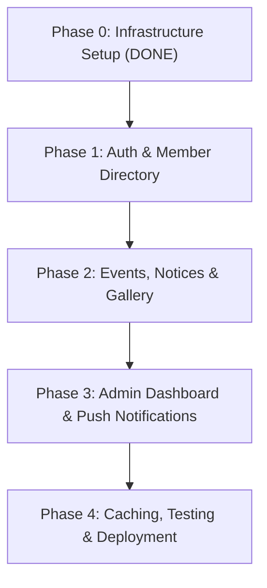

# MYS CONNECT — Detailed Implementation Roadmap

This document outlines the phase-by-phase development path to build the full **MYS CONNECT** platform based on [PRD.md](file:///d:/mys/PRD.md).

---

## 🟢 PHASE 0: Infrastructure & Project Setup (COMPLETED)

- [x] **0.1 Monorepo Architecture**: Setup workspace root with `apps/mobile`, `server`, `apps/admin`, `packages/shared`.
- [x] **0.2 Database Infrastructure**: PostgreSQL 16 container (`mys_postgres`) running on port `5433` via Docker Compose.
- [x] **0.3 Database Schema & ORM**: 16 Prisma models (`User`, `Profile`, `City`, `Event`, `Notice`, `Album`, `Notification`, etc.) created and synced.
- [x] **0.4 Seed Data**: Initial seed executed for 9 Jharkhand cities and 13 application configuration settings.
- [x] **0.5 Mobile App Scaffolding**: Expo SDK 57 + Expo Router app with `@clerk/expo` and `expo-secure-store`.
- [x] **0.6 Design System**: Theme tokens configured (`Colors.ts` maroon/gold, `Typography.ts`, `Spacing.ts`, `theme.ts`).
- [x] **0.7 Backend Server**: Express.js server with TypeScript, CORS, Helmet, Winston logger, and rate limiters.
- [x] **0.8 Admin Dashboard**: Next.js App Router project initialized at `apps/admin/`.
- [x] **0.9 Cloudinary Integration**: Added Cloudinary skills (`npx skills add cloudinary-devs/skills`).

---

## 🟡 PHASE 1: Authentication, Registration & Member Directory (Next Step)

### Milestone 1.1: Backend User & Auth API (COMPLETED ✅)
- [x] Build Clerk Webhook handler (`POST /api/v1/webhooks/clerk`) to sync Clerk user creation into Prisma DB as `PENDING` status.
- [x] Build User Profile endpoints (`GET /api/v1/users/me`, `POST /api/v1/users/register`, `GET /api/v1/users/cities`).
- [x] Integrate Clerk User Banning & Unbanning API (`banClerkUser` & `unbanClerkUser`) linked to Prisma DB `status` (`PENDING`, `ACTIVE`, `DEACTIVATED`, `REJECTED`).
- [x] Build Admin User Management API (`GET /api/v1/admin/users`, `POST /api/v1/admin/users/:id/status`, `POST /api/v1/admin/users/:id/role`).

### Milestone 1.2: Mobile Authentication & Registration Screens (COMPLETED ✅)
- [x] **Splash & Onboarding Guard Screen**: Route check for auth state & approval status (`PENDING`, `ACTIVE`, `DEACTIVATED`).
- [x] **Sign In Screen**: Email & password auth using `@clerk/expo` `useSignIn` with MYS branding and error handling.
- [x] **Sign Up Screen**: Account creation and OTP verification code modal using `useSignUp`.
- [x] **Complete Profile Screen**: 4-step registration form collecting Personal, Location/City, Family/Gotra, and Professional details.
- [x] **Pending Approval Screen**: Dedicated screen for users awaiting admin verification.
- [x] **Deactivated Screen**: Screen displayed when account is banned or rejected.
- [x] **Member App Shell**: Bottom tabs for active approved members (Home, Directory, Events, Notices, Profile).

### Milestone 1.3: Member Directory & Profiles
- [ ] Backend Member API:
  - `GET /api/v1/members` — Paginated directory with search, City filter.
  - `GET /api/v1/members/:id` — Detail view for individual member.
- [ ] Mobile Directory UI:
  - Member search bar & filter modal (City, Occupation).
  - Member card list with avatar, name, city tag.
  - Member Profile Detail screen with direct Call, WhatsApp, and Email action buttons.

---

## 🔵 PHASE 2: Core Community Modules (Events, Notices & Gallery)

### Milestone 2.1: Events Module
- [ ] Backend Event Endpoints:
  - `GET /api/v1/events` — Upcoming & past events list.
  - `GET /api/v1/events/:id` — Event details with attendee list.
  - `POST /api/v1/events/:id/rsvp` — RSVP action (`GOING`, `NOT_GOING`, `MAYBE`).
  - `POST /api/v1/admin/events` — Admin create/edit event.
- [ ] Mobile Event UI:
  - Events tab (Upcoming vs Past segment toggle).
  - Event detail screen with venue map link, RSVP toggle, countdown timer.

### Milestone 2.2: Notices & Announcements
- [ ] Backend Notice Endpoints:
  - `GET /api/v1/notices` — List active notices (filtered by priority/pinned).
  - `POST /api/v1/admin/notices` — Admin publish notice.
- [ ] Mobile Notice UI:
  - Notice Board feed with priority indicators (Urgent badge, Pinned banner).
  - Notice detail modal with attachment download/view.

### Milestone 2.3: Photo Gallery / Albums
- [ ] Backend Gallery Endpoints:
  - `GET /api/v1/albums` — Album grid with cover images.
  - `GET /api/v1/albums/:id` — Album photo grid.
  - Cloudinary upload integration for admin photo uploads.
- [ ] Mobile Gallery UI:
  - Album grid view with image count badges.
  - Fullscreen photo viewer with pinch-to-zoom and swipe gesture.

---

## 🟣 PHASE 3: Admin Dashboard & Push Notifications

### Milestone 3.1: Admin Web Dashboard (`apps/admin`)
- [ ] **Dashboard Overview**: KPI cards (Total Members, Pending Approvals, Upcoming Events, Active Notices).
- [ ] **Member Management Table**:
  - Filter by status (`PENDING`, `ACTIVE`, `DEACTIVATED`).
  - Single-click Approve / Reject member with reason note.
  - Member role assignment (`ADMIN`, `MODERATOR`, `MEMBER`).
- [ ] **Content Management UI**:
  - Event creation form with cover image upload.
  - Notice editor with priority selection & pin toggle.
  - Album creator & multi-photo uploader.

### Milestone 3.2: Notifications & Socket.io Realtime
- [ ] **Expo Push Notifications**:
  - Register push token on mobile startup (`POST /api/v1/notifications/push-token`).
  - Trigger push notifications on: Registration Approval, Urgent Notice, Event Reminder.
- [ ] **In-App Notification Center**:
  - `GET /api/v1/notifications` — Notification list.
  - Unread badge counter in mobile app header.

---

## 🔴 PHASE 4: Offline Caching, Polish, Testing & Deployment

### Milestone 4.1: Offline Caching & Performance
- [ ] Implement `@react-native-async-storage/async-storage` cache for Directory, Events, and Notices.
- [ ] Enable image caching via `expo-image` with Cloudinary transformations (`f_auto,q_auto,w_400`).

### Milestone 4.2: QA, Security & Deployment
- [ ] **Role-Based Access Verification**: Test RBAC enforcement for Guest vs Member vs Admin.
- [ ] **Production Docker Containerization**: Create Dockerfile for Express backend.
- [ ] **EAS Build Setup**: Build Android APK & iOS build for device testing.

---

## 📊 Summary Execution Sequence

